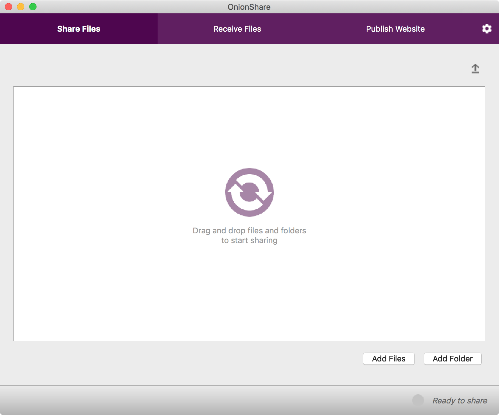
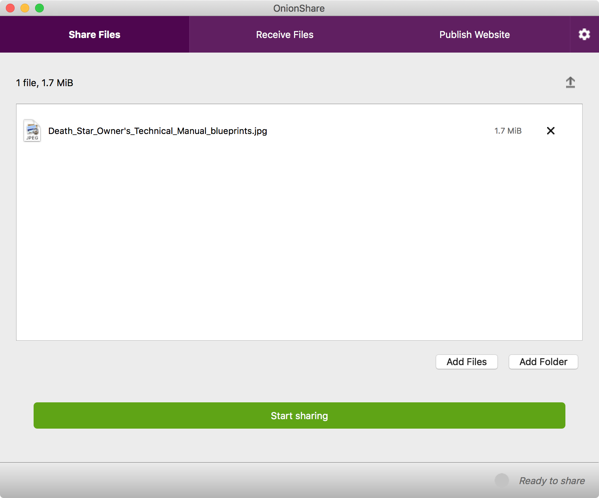
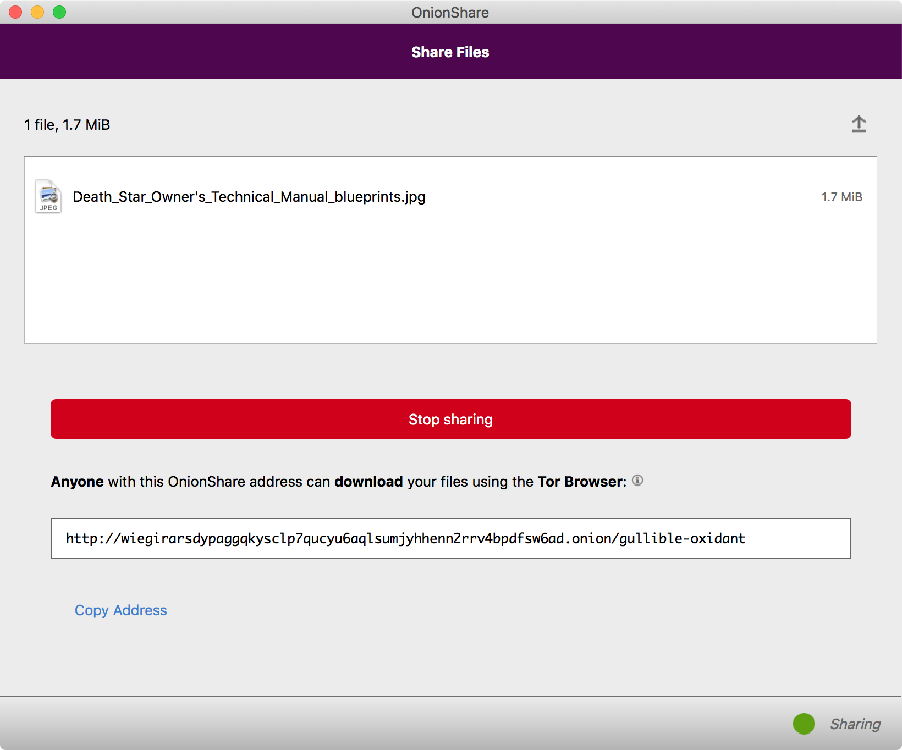
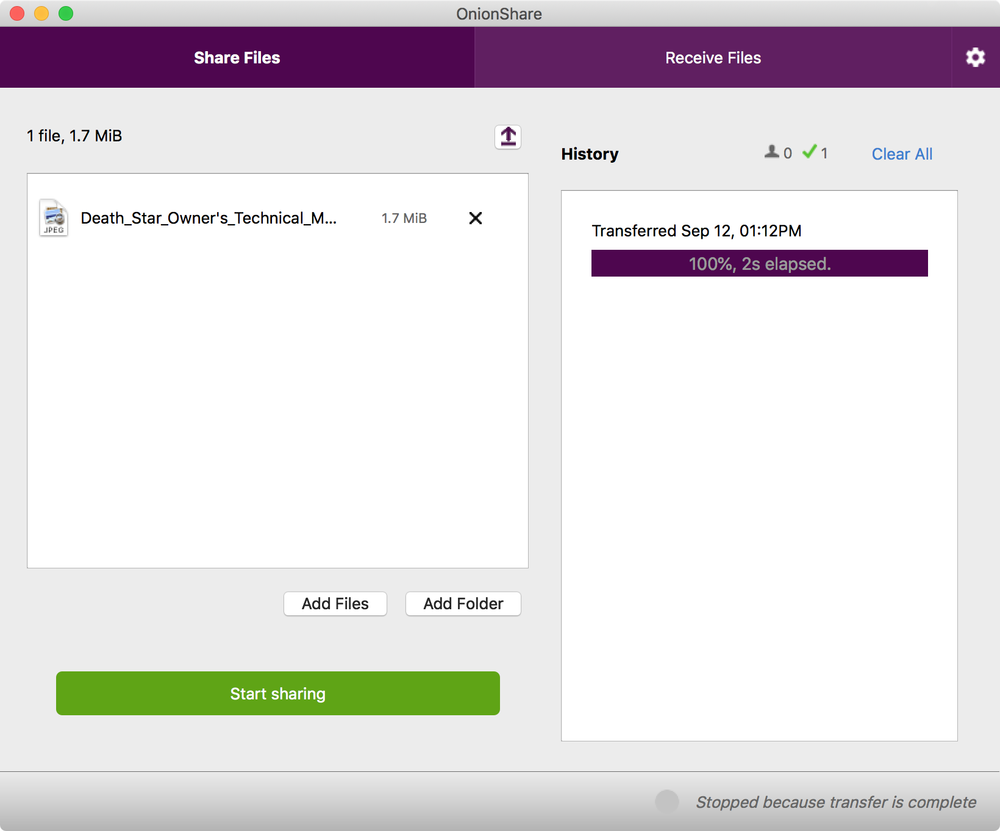
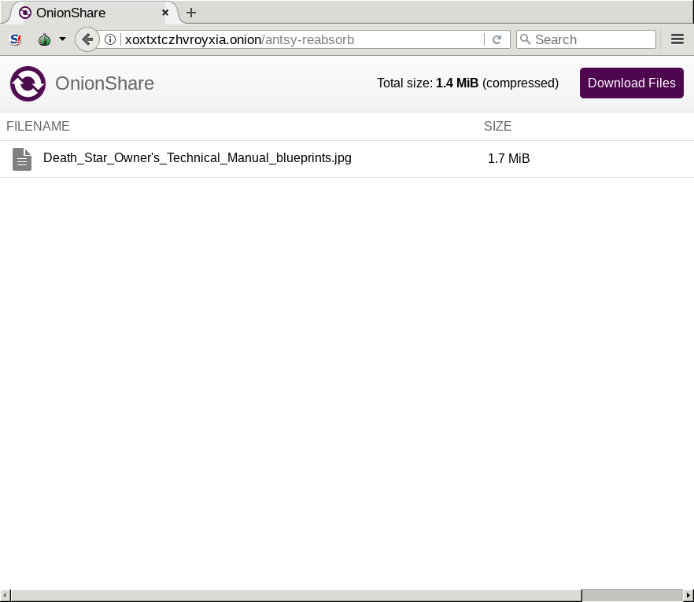
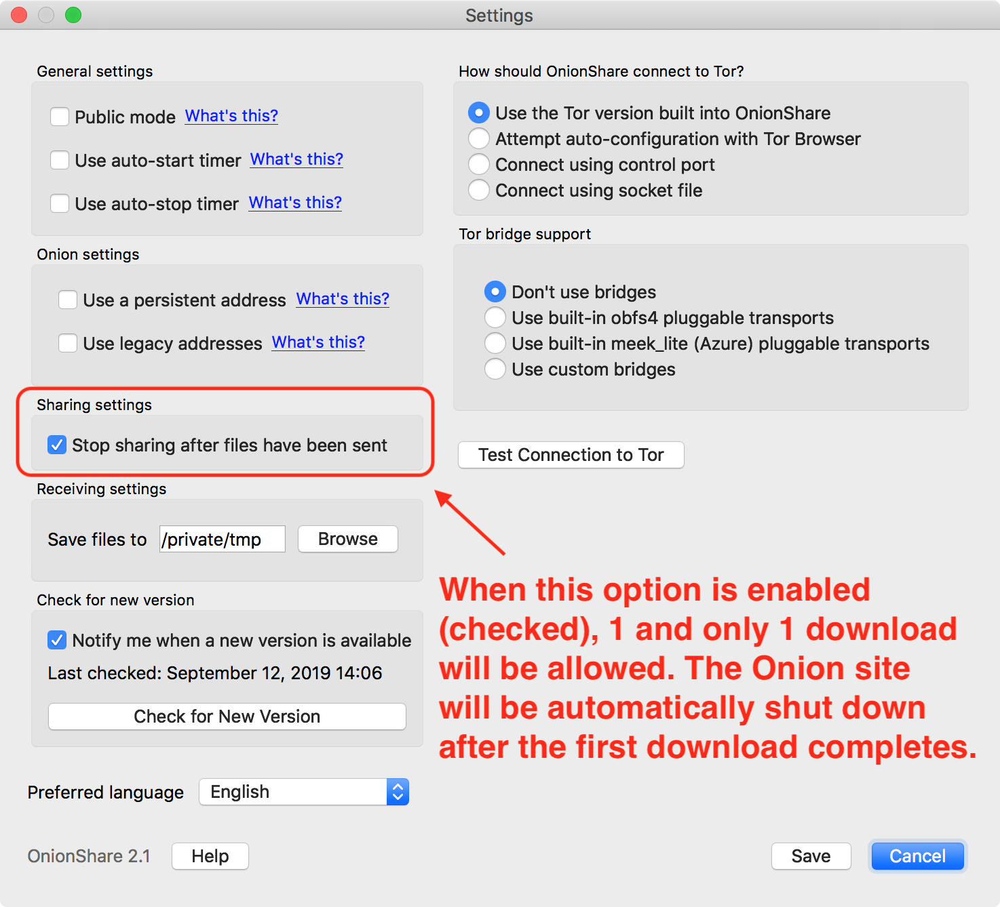

# Secretly sharing files with OnionShare and Tor Browser

In this exercise we will create a temporary (ephemeral) *Darknet* Website called an *Onion site* using the Tor anonymity system. We will use our Onion site to secretly transfer a "sensitive" file to a friend. Our goal is to successfully give our friend a copy of the sensitive file without exposing so much as *the fact that* we have even transferred the file in the first place.

Essentially, we will be creating a kind of *digital [dead drop](https://en.wikipedia.org/wiki/Dead_drop)*.

1. [Objectives](#objectives)
1. [Scenario](#scenario)
1. [Prerequisites](#prerequisites)
1. [Set up](#set-up)
1. [Practice](#practice)
    * [Sender steps](#sender-steps)
    * [Receiver steps](#receiver-steps)
1. [Discussion](#discussion)
    1. [OnionShare Receive Mode](#onionshare-receive-mode)
    1. [Enabling or disabling multiple downloads](#enabling-or-disabling-multiple-downloads)
1. [Additional references](#additional-references)

# Objectives

When you complete this exercise, you will have acquired the following capabilities:

* The ability to share files without revealing your location, whether your own physical ("real world") location or your computer's logical ("Internet address") location.
* The ability to transfer file(s) without relying on corporate providers such as Google, Facebook, or Microsoft; no usernames or account passwords to remember.
* The ability to share files even if you are located behind restrictive firewalls or censored networks such as school, library, or employment networks.

# Scenario

[You are part of the Rebel Alliance (and a traitor)!](https://www.youtube.com/watch?v=2XOzyBQ594E) In order to avoid certain defeat at the hands of The Empire, you must transmit the Death Star plans to a friend of yours, a fellow resistance fighter, whose contact information you already have. However, if you are observed communicating with your friend, you will both be arrested and charged with conspiracy to commit treason against The Emperor.

Your mission is to arrange for the secret transfer of the Death Star plans from your computer to their computer, so that they may deliver the plans to Alliance Headquarters.

# Prerequisites

To participate in this exercise, you must have:

* A friend! :) (You can also do this exercise yourself by role-playing both the sender and receiver portions, but everything is more fun with friends.)
* A computer running any modern version of:
    * Windows,
    * macOS, or
    * any flavor of the GNU/Linux operating system.
* An active Internet connection. (The Internet connection may be censored or surveilled, such as that on a public Wi-Fi network or at an institutional facility such as a public library. In fact, it likely is!)

# Set up

In addition to your laptop or desktop computer and an active Internet connection, you will need to acquire (at least) two tools:

* [Tor Browser](https://www.torproject.org/download/download-easy.html)
* [OnionShare](https://onionshare.org/)

Follow the above links. Then download and install the appropriate software package for your operating system. The installation process for both tools should be familiar, since they are performed in the same way as for any other software application that runs on your operating system.

# Practice

Agree on roles for yourself and your friend. One of you will be the sender, the other will be the receiver. Then follow the steps below for your role:

## Sender steps

As the sender, you must prepare an Onion site able to transmit the files to the receiver when they initiate the transfer.

* **[Download the Death Star plans](Death_Star_Owner%27s_Technical_Manual_blueprints.jpg)**, if you do not already have them. (Pretend that you did.)

**Do this:**

1. Launch OnionShare. (Usually, this is as simple as clicking or double-clicking its icon.) You will be presented with the main OnionShare window:  
   
1. Drag-and-drop the Death Star plans into the main OnionShare window, or click either the *Add Files* or *Add Folder* button and browse to the location of the Death Star plans on your computer to add them to your soon-to-be Onion site:  
   
1. Click the *Start Sharing* button. Wait a few moments as OnionShare prepares your Onion site.
    * When the Onion site is successfully running, the gray indicator light will turn green and the "Start Sharing" button will change to read "Stop Sharing" instead.
    * Additionally, a new link will appear ("Copy URL") near a Web address that will look something like `http://wiegirarsdypaggqkysclp7qucyu6aqlsumjyhhenn2rrv4bpdfsw6ad.onion/gullible-oxidant`.
    

Now comes the tricky part! You must find a way to securely, secretly communicate this Web address to your friend. Remember, if you are caught communicating this secret information to your friend, you will spend time in an Imperial detention facility for sure, or worse! This step is intentionally ommited from this exercise; if you are not sure what to do, consult the other exercises in this repository, search the Internet for advice, or ask the facilitator of the workshop if one is available.

1. Once you have safely communicated the location of your secret Onion site to your friend, you must return to the main OnionShare window.
1. Pay close attention to the OnionShare status bar (the very bottom of the OnionShare window).
    * When your friend successfully arrives at your Onion site, you will receive a "Page Loaded" notification.  
      
    * When your friend successfully begins receiving the files, you can view their download progress by clicking on the upload icon in the top-right of the OnionShare window to reveal OnionShare's upload progress.  
      
1. You must ensure that this download completes!
    * Do not close OnionShare during this process.
    * Do not interrupt your Internet connection during this process.
    * Do not put your computer to sleep, hibernate, or let it be shut down until the download has completed.
1. Once the download has completed, OnionShare's indicator light will turn back to gray and report that sharing is "*Stopped because transfer is complete*" in its status bar. This ensures that no one else will be able to download the sensitive file. (See [§ Enabling or disabling multiple downloads](#enabling-or-disabling-multiple-downloads) to learn more about this fact.)

## Receiver steps

As the receiver, you must acquire knowledge of the secret Onion site where the Death Star plans are waiting for you to pick them up.

**Do this:**

1. Launch the Tor Browser. (Usually, this is as simple as double-clicking its icon.)
1. Click on the *Connect* button when presented with the *Tor Network Settings* dialogue screen:  
     
   This will connect your computer to the Tor anonymity network.
1. After Tor has successfully connected, you will see a Web browser window open and display (something that looks similar to) the following page:  
   

Now comes the tricky part! You must find a way to securely, secretly communicate with your friend to learn the Web address of their Onion site. Remember, if you are caught requesting this secret information from your friend, you will spend time in an Imperial detention facility for sure, or worse! This step is intentionally ommited from this exercise; if you are not sure what to do, consult the other exercises in this repository, search the Internet for advice, or ask the facilitator of the workshop if one is available.

1. Once you have acquired the Onion site's Web address, carefully type it verbatim (or copy-and-paste it) into the location bar of your open Tor Browser, then press the "Go" button or press the Return key. If successful, you should see a page like the following:  
   
1. Click on the "*Download Files*" button to begin the download.
    * OnionShare may package the files in a single `.zip` archive.
1. After the download is complete, you may need to [uncompress the downloaded ZIP file](http://www.computerhope.com/issues/ch000506.htm).
1. Confirm that the Death Star plans are now in your posession.

# Discussion

> :construction: TK-TODO

## OnionShare Receive Mode

In the above exercise, the "sender" role was responsible for creating the Onion site using OnionShare, while the "receiver" role was responsible for downloading the sensitive file from the Onion site using Tor Browser. To accomplish this, the sender used the default OnionShare mode, called "*Share Files*." The OnionShare mode can be toggled to "[*Receive Mode*](https://github.com/micahflee/onionshare/wiki/Receive-Mode)," which means that the person using OnionShare will become the receiver while the person using Tor Browser will become the sender.

While useful, you should be aware that flipping these roles has several important operational security (OPSEC) considerations! Take a moment to think through what these might be. Here are some starting prompts:

* If the person who has the sensitive file is physically on the run, they may not be able to keep their laptop open and OnionShare running long enough to wait for their comrade to connect. In this case, it may be useful for the receiver rather than the sender to create the Onion site using OnionShare's Receive Mode.
* The longer an Onion site is available, the more likely it is that it will be found out. Carefully consider which one of you ("receiver" or "sender") has more stability and can more safely operate the Onion site.
* Putting OnionShare in Receive Mode means that other anonymous people will be able to upload files to your computer. These files may not be what you *expect* to receive! What are some ways you can safely examine the files you receive before they can damage your computer or your safety? (This also applies to files you download, not just files uploaded to you by others!)
* OnionShare supports an advanced feature known as Onion service client authorization or "[*Stealth Mode*](https://github.com/micahflee/onionshare/wiki/Stealth-Onion-Services)". This makes it possible to restrict which Tor clients (e.g., Tor Browsers) can connect to your Onion site, but is more difficult to set up. See "[Connecting to an authenticated Onion service](https://github.com/AnarchoTechNYC/meta/wiki/Connecting-to-an-authenticated-Onion-service)" for details.

## Enabling or disabling multiple downloads

Immediately after the receiver finishes downloading the sensitive file, the sender's Onion site automatically shuts down. This means no one can connect to it any longer, effectively ensuring that one and only one receiver can download the shared file(s). In our example scenario, this is exactly the behavior we want because it is critical to ensure that only the intended recipient is the one who received the sensitive file, but this may not be desirable in all situations.

To allow multiple downloads, you must instruct OnionShare not to shut down your Onion site after the first download that has begun is finished. To do this, you need to *disable* the "[*Stop sharing after files have been sent*](https://github.com/micahflee/onionshare/wiki/Configuring-OnionShare#stop-sharing-after-first-download) option in OnionShare's *Settings* screen.

**Do this** to allow multiple downloads:

1. Click the gear icon next to the OnionShare mode toggle to open the OnionShare Settings screen. The gear icon looks like this:  
   
   The *OnionShare Settings* window will appear.
1. Deselect (uncheck) the "*Stop sharing after files have been sent*" option:
   

As always, consider the security implications of what you are doing when you disable this option and allow multiple downloads. In what scenarios does it make sense to allow multiple downloads, and in what scenarios are you better off using a different approach? For example:

* Would it be better to start a new share for a new receiver? By default, each time you press the "Start Sharing" button, OnionShare generates a completely new Onion site (with a completely different `.onion` address) for you to use. Even if you are sharing the same material with multiple people, you may want to give each of them their own `.onion` address, so that any interception of your communication of the address itself does not inherently associate each receiver with the others.

# Additional references

* [How to use the Tor Browser to surf the Web anonymously](http://www.pcworld.com/article/2686467/how-to-use-the-tor-browser-to-surf-the-web-anonymously.html)
* [OnionShare wiki](https://github.com/micahflee/onionshare/wiki)
* [Tor Project: Onion Services](https://community.torproject.org/onion-services/)
