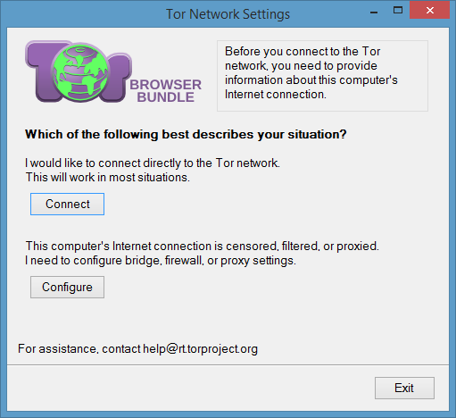
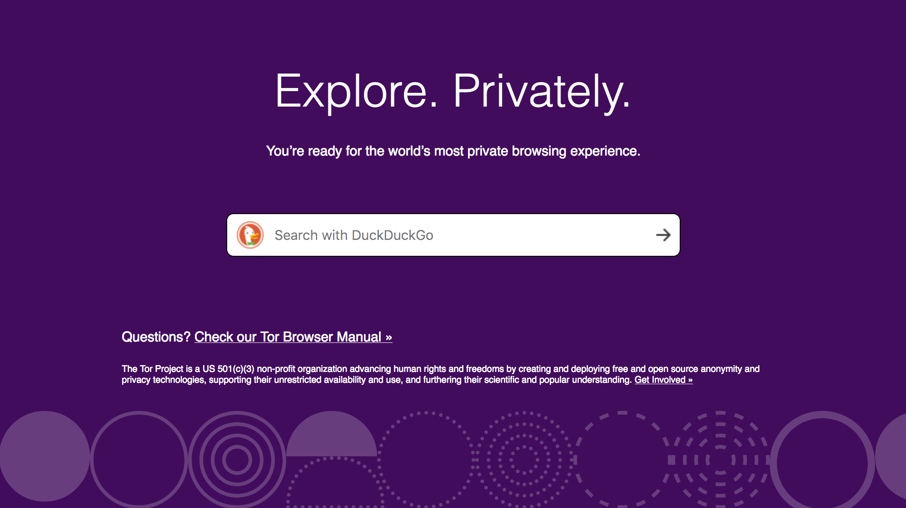
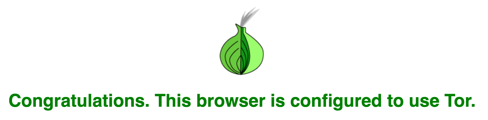
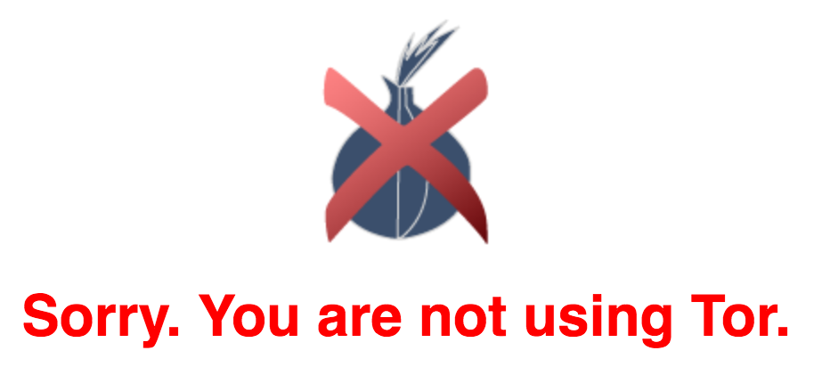
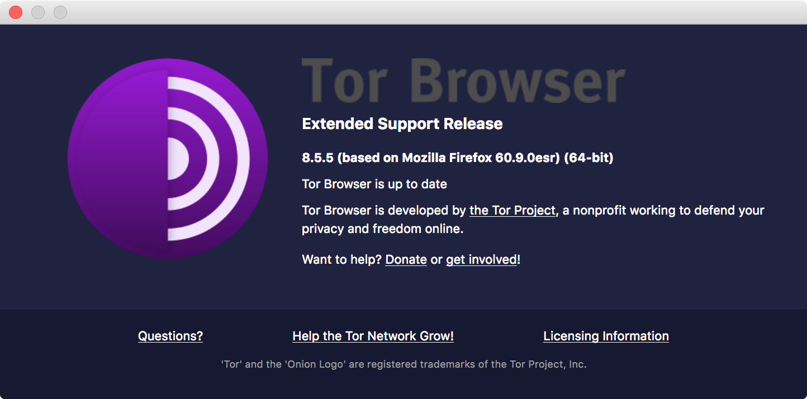
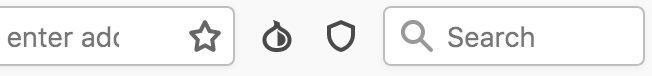
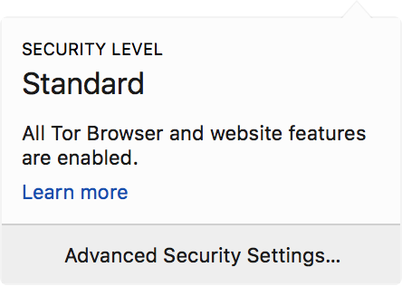
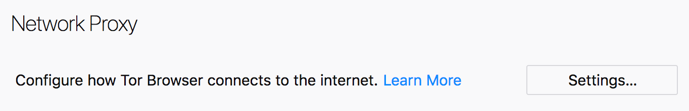
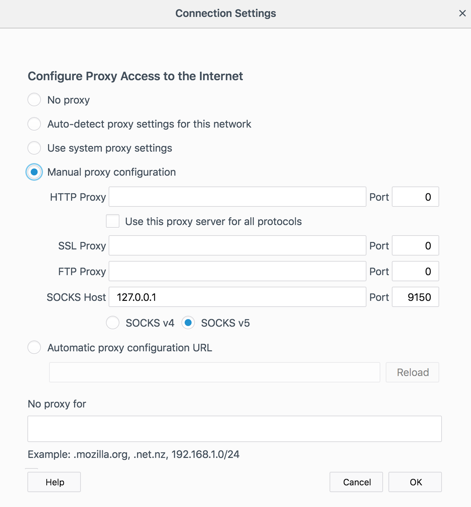

# Introduction to Anonymous Communications Using Tor

*Tor* is a free, state-of-the-art, privacy-enhancing digital communications tool that evolved from work originally performed at the United States's Naval Research Laboratory (NRL) in the mid 1990's. Today, its steward is the [Tor Project](https://torproject.org/), a US-based registered 501(c)3 non-profit organization that coordinates ongoing work by the Free and Open Source Software (FOSS) community on Tor itself along with its related software components, such as the *Tor Browser*. Tor's core privacy-enhancing feature is its implementation of an encrypted [*onion routing*](https://en.wikipedia.org/wiki/Onion_routing) protocol that makes it possible to obscure the destination of a message from the message's intermediary handlers as well as simultaneously obscuring the source of the message from the recipient at the destination.

This ability to hide both the source and destination of messages makes Tor an invaluable tool in any privacy advocate's toolkit, since it enables both more anonymous online speech and far improved censorship circumvention efforts. After all, anonymity and censorship circumvention go hand-in-hand. If a censor does not know what information is being requested (because the destination is obscured), how can it know whether or not to perform any censorship? Similarly, if a server cannot determine who sent it a message (because the source is obscured), how can it make any discriminatory decisions based on that sender's identity?

While there are other privacy- and anonymity-enabling digital toolkits, the tools that the Tor Project is responsible for maintaining are arguably the most widely deployed and most rigorously tested by security researchers, academics, and cryptographers. This makes using Tor a good choice for many people who need or desire a safer, more private Internet, such as journalists, whistleblowers, activists, business people, and any privacy-conscious ordinary individual. In fact, Tor is famous both for [frustrating surveillance efforts](https://www.theguardian.com/world/interactive/2013/oct/04/tor-stinks-nsa-presentation-document) (even of very powerful entities such as the National Security Agency) and for its role in facilitating anonymous online interactions on the so-called "[*Dark Web*](https://en.wikipedia.org/wiki/Dark_web)."

In this practice lab, you will learn how Tor can maximize your privacy while using the Internet. In the process, we will demystify frequently misrepresented terms (such as "Dark Web"!) and debunk numerous myths and misconceptions about what Tor is, how it works, and why [it can be valuable for you even if you are not hunted by your government or other law enforcement agency](https://github.com/alecmuffett/real-world-onion-sites "View a list of substantial, commercial-or-social-good mainstream websites which provide onion services."). Although familiarity with some basic computer networking concepts will be helpful, we try to present the material herein in a way that people new to digital privacy can still benefit, such as by illuminating the fact that *how one uses Tor* is just as important as the technical underpinnings of *how Tor works*.

# Contents

1. [Objectives](#objectives)
1. [Bill of materials](#bill-of-materials)
1. [Prerequisites](#prerequisites)
1. [Set up](#set-up)
    1. [Tor Browser installation on Windows](#tor-browser-installation-on-windows)
    1. [Tor Browser installation on macOS](#tor-browser-installation-on-macos)
    1. [Tor Browser installation on GNU/Linux](#tor-browser-installation-on-gnulinux)
1. [Practice](#practice)
    1. [Introduction](#introduction)
    1. [Your first Tor connection](#your-first-tor-connection)
    1. [Understanding the difference between Tor and Tor Browser](#understanding-the-difference-between-tor-and-tor-browser)
        1. [Tor Browser as a Web browser](#tor-browser-as-a-web-browser)
            1. [Tor Browser is a Firefox fork](#tor-browser-is-a-firefox-fork)
            1. [Tor Browser includes privacy-enhancing add-ons by default](#tor-browser-includes-privacy-enhancing-add-ons-by-default)
            1. [Tor Browser includes custom, Tor-specific add-ons](#tor-browser-includes-custom-tor-specific-add-ons)
    1. [Understanding Tor circuits and relays](#understanding-tor-circuits-and-relays)
        1. [Guard relays](#guard-relays)
        1. [Middle relays](#middle-relays)
        1. [Exit relays](#exit-relays)
    1. [Using the New Identity button to isolate risky activities](#using-the-new-identity-button-to-isolate-risky-activities)
    1. [Internet censorship and circumvention basics](#internet-censorship-and-circumvention-basics)
        1. [Detecting a censored Internet connection](#detecting-a-censored-internet-connection)
        1. [Circumventing DNS-based censorship without Tor](#circumventing-dns-bsed-censorship-without-tor)
        1. [Circumventing application-layer censorship](#circumventing-application-layer-censorship)
        1. [Connecting to the Tor network via a Tor Bridge when Tor itself is censored](#conecting-to-the-tor-network-via-a-tor-bridge-when-tor-itself-is-censored)
    1. [Connecting to an authenticated Onion service](#connecting-to-an-authenticated-onion-service)
    1. [Torifying arbitrary applications](#torifying-arbitrary-applications)
        1. [Using proxy settings](#using-proxy-settings)
        1. [Torifying SSH](#torifying-ssh)
    1. [Your first Onion service](#your-first-onion-service)
    1. [Adding Tor authentication to your Onion service](#adding-tor-authentication-to-your-onion-service)
1. [Discussion](#discussion)
    1. [Browser add-ons for improved privacy](#browser-add-ons-for-improved-privacy)
    1. [Browser fingerprinting](#browser-fingerprinting)
    1. [More about SOCKS proxies](#more-about-socks-proxies)
    1. [Verifying `.onion` TLS certificates using `MapAddress`](#verifying-onion-tls-certificates-using-mapaddress)
    1. [Additional Tor infrastructure: Directory Authorities](#additional-tor-infrastructure-directory-authorities)
    1. [Tor circuits to Onion services](#tor-circuits-to-onion-services)
1. [Additional references](#additional-references)

# Objectives

When you complete this lab, you will have acquired the following capabilities:

* The ability to proficiently use the Tor Browser to safely perform otherwise risky activites on the Web.
* The ability to detect, diagnose, and circumvent basic censorship activity blocking your access to the Internet.
* The ability to connect to online services that require Tor authentication credentials ("authenticated Onion services").
* The ability to "Torify" arbitrary applications, i.e., to proxy arbitrary applications's network requests through the Tor network.
* The ability to operate a basic Onion service ("Dark Web site") in both unauthenticated (publicly-accessible) and authenticated (more private) modes.

# Bill of materials

This folder contains the following files and folders:

* `README.md` - This file.

# Prerequisites

To perform this lab, you must have:

* A computer running any modern version of:
    * Windows,
    * macOS, or
    * any flavor of the GNU/Linux operating system.
* An active Internet connection.

# Set up

In addition to your laptop or desktop computer, you will need to acquire the following tools.

* [Tor Browser](https://www.torproject.org/download/)

Follow the above link. Then download and install the appropriate software package for your operating system. The installation processes should be familiar, since they are performed in the same way as for any other software application that runs on your operating system.

## Tor Browser installation on Windows

> :construction: TODO

## Tor Browser installation on macOS

> :construction: TODO

## Tor Browser installation on GNU/Linux

> :construction: TODO

# Practice

We'll begin by ensuring you have successfully completed the [set up](#set-up) steps. This process will also introduce the fundamentals that you need to understand to complete the rest of the exercise.

## Introduction

Although not officially an acronym, *Tor* is a state-of-the-art implementation of an *onion routing* system, so you could be forgiven for mistaking the name as an acronym for *The Onion Router*. Onion routing takes its name from the idea of wrapping something valuable up inside multiple layers of difficult-to-penetrate protection that must be unwrapped one at a time, "like the layers of an onion." On a computerized *onion network* (such as the *Tor network*), this protection is encryption. You might also hear the Tor network colloquially described as "*onionland*," so named both for the fact of its onion routing protocol and the [officially reserved top-level domain for servers on its network, whose names end in `.onion`](https://en.wikipedia.org/wiki/.onion).

Each message transmitted by your copy of the Tor software is (by default) *encapsulated* inside three layers of Tor's encrypted onion routing scheme, so that by the time your computer delivers your message to the Tor network itself, the content of your communication is already well-protected from potentially nosy Internet Service Providers (ISPs), weakly secured Wi-Fi networks, and other eavesdroppers who are positioned more closely to your own computer. Moreover, this thrice-layered protection even offers some defense against potentially malicious Tor network participants. The first participating Tor network computer your computer contacts may learn some bits of information about who you are, but it will not be able to discern where your message is ultimately destined. Inversely, the final participating Tor network computer your computer contacts may learn some bits of information about your message, but it will not be able to discern who sent that message unless you explicitly or, worse, accidentally tell it that you are the source.

The Tor network itself is made up of other computers very much like your own that are also running copies of the same Tor software in various configurations. This means that anyone who has a copy of the Tor software can use Tor both to provide privacy for their own communications&mdash;we call this *Tor client* behavior&mdash;as well as opt-in to donating a portion of their computer's own resources (its processing speed, network bandwidth, etcetera) to protect the privacy of other Tor users's communications&mdash;this is called *Tor relay* behavior.

By itself, Tor may seem to do very little because it merely provides an onion-routed transport channel for other applications. For example, the Tor Browser application uses the core Tor software to provide the ability to browse the Web through the Tor network. That is, Tor is proxying the Tor Browser's messages. We say that the Tor Browser is a "*torified* Web browser," meaning simply that it is a Web browser whose connections are going through the Tor network, i.e., they are "torified." Many applications beyond Web browsers can make use of Tor, of course, including instant message (IM) chat apps, digital calendaring services, contact books, e-mail, and much more. In each case, the application providing the specific functionality (such as IM chat) must be torified in order to gain the protections offered by Tor.

We'll soon see some examples of how to torify various applications but, first, let's go ahead and make our very first connection to Tor's onion routing network.

## Your first Tor connection

Connecting to the Tor network is deceptively simple, even anti-climactic. After hearing so much about the "Dark Web," you may be under the impression that accessing it takes superhero-like feats of technical acuity. In reality, accessing the Tor network in the simplest situation means launching the Tor Browser application and clicking the "Connect" button.

**Do this** to make your first connection to the Tor network via the Tor Browser:

1. Double-click on the Tor Browser icon that you downoaded earlier by following the [Set up](#set-up) steps. The Tor Network Settings wizard will open:  
   
1. Click the *Connect* button.
1. If all goes well, you will be connected to the Tor network. The Tor Browser will present you with a new window that may look very familiar, because it is based on a popular Web browser's interface. In the Web browser's viewport, you will see (something that looks similar to) the following screenshot:  
    

Believe it or not, you are now connected to the Tor network and, should you so desire, you can browse both regular Internet Web sites or *clearnet* sites as well as more anonymized *darknet* or *onionland* sites. All you need to know is what Web address (URL) to type into the Tor Browser's location bar, just as you would need to know for any other Web site using any other Web browser.

As a quick example, try visiting the clearnet (regular, non-Tor) Web page at [`check.torproject.org`](https://check.torproject.org/) from within the Tor Browser. You should be greeted with a page that happily informs you, "Congratulations. This browser is configured to use Tor," in big green lettering.

This page offers you a quick way to check whether your Tor connection is working.

Now compare this result with the page you are presented with when you load the same Web site using a browser other than the Tor Browser. You will probably see a different message reading, "Sorry. You are not using Tor," written in big red lettering.

As you can see, the page reports whether or not you are connecting to it via the Tor network. If you are, you can browse both the regular, clearnet Internet, as well as Web sites published on `.onion` domains. But before we recklessly go gallivanting around the Dark Web, let's learn a little bit about what just happened and more about the tools we're using.

## Understanding the difference between Tor and Tor Browser

While Tor is often discussed as a single, monolithic thing, the reality is more complex. While it's not exactly incorrect to speak of Tor as a single tool, this brevity can fog up your understanding of what Tor really is and how it really works. On the one hand, being too specific about Tor's componentry borders on unnecessary pedantry. On the other, taking a look under the metaphorical hood can help you see the major parts that need to work together to make the whole work.

For an introduction to Tor, there are thankfully only two major pieces that you should understand are distinct components. These are:

* Tor *Browser*, and
* Tor "itself."

When you download and install the Tor Browser software package, you are actually downloading *both* parts bundled together in a single app. This used to be more explicit in earlier versions of the Tor Browser software package than it is now. What we now call simply "Tor Browser" used to be called the Tor Browser *Bundle* (TBB). Numerous additional software components were included in this "bundled" package that have since been replaced by custom Web browser extensions built into the Browser part of the Tor Browser, but there will likely always still be at least these two major components in the "Tor Browser" package.

As the name implies, the Tor *Browser* is a Web browser. It is the part of the Tor Web browsing experience that you spend most of your time interacting with, and it is designed to look and feel more or less like any other Web browser you may be accustomed to using. Meanwhile, the *Tor* part is the software that torifies (i.e. proxies via the Tor network) the network traffic produced and consumed by the Tor Browser. This second part has no graphical user interface, no window you can drag around your screen or resize, and no buttons or preference boxes with which you can adjust its many settings and options.

These two parts are designed and built as two independent software programs in their own right. They have different development teams, independent goals, and some of their own project infrastructures. However, also as the name implies, Tor Browser depends on Tor. Without the Tor part, the Tor Browser is, well, not the *Tor* Browser. Due to this dependent relationship, we say that the Tor project is *upstream* of the Tor Browser project, which, as you might expect, is therefore *downstream* of the Tor project. Both projects are stewarded by the Tor Project non-profit proper and are, of course, closely related, but from the software's viewpoint they are distinct and independent groups.

Implicit in this architecture is the fact that Tor can be used&mdash;and is quite useful&mdash;on its own, without the Tor Browser. Indeed, if you wanted to use Tor for purposes other than Web browsing, you could download a "*system Tor*" instead of downloading the Tor Browser (bundle). You could then use your browser-less system Tor to torify whatever other applications you have. You could even torify other Web browsers, such as Apple's Safari or Microsoft's Edge, and browse the Dark Web using those browsers. That being said, there are very good reasons to download and use the Tor Browser as your primary torified Web browser instead of Web browsers not designed for the purpose, and we'll soon demonstrate many reasons why this is so.

In the mean time, now that you know these are two different but cooperating pieces of software, let's take a closer look at each of them starting with the more familiar of the two, the Tor Browser.

### Tor Browser as a Web browser

As the name implies, Tor Browser is a Web browser. Also as the name implies, it is a *torified* Web browser, which means that it is set up in such a way as to ensure that all of its network traffic is routed through the Tor network. But there are additional improvements to your online privacy that Tor Browser provides that are important to know about beyond merely onion routing.

#### Tor Browser is a Firefox fork

The Tor Browser's interface may already be very familiar to you if you have ever used a modern Web browser, such as Google Chrome or [Mozilla Firefox](https://www.mozilla.org/firefox/). In fact, if you are a Firefox user, the Tor Browser probably looks *extremely* familiar. There is a good reason for that: the Tor Browser is based on Mozilla Firefox! View the Tor Browser's "About" window (by going to, for example, the *Tor Browser* &rarr; *About Tor Browser* menu item on a macOS computer) and you'll see this fact reported plain as day:

In the screenshot, you can see that the Tor Browser reports it is "based on Mozilla Firefox," gives its Firefox version number, and then the three-letter acronym ESR, which stands for Extended Support Release. These special release versions of Mozilla Firefox are, as their name implies, supported by Mozilla for longer than other versions of their Firefox Web browser are. The Tor Browser is based on these specific versions because these versions change less quickly and thus offer the Tor Browser team a slower moving target at which they can aim their special, privacy-enhancing modifications to the Firefox code, making Tor Browser development a lot easier. When a project is "based on" another project in this way, programmers call it a *fork* of the original ("upstream") project.

Basing itself on Firefox also provides the Tor Browser with a number of other dramatic benefits. Not least among these is the fact that the Tor Browser team does not need to write a whole new Web browser from scratch. Instead, as Mozilla updates and improves the underlying Web browsing technology in its Firefox product, the Tor Browser automatically and freely gets these improvements, too. So, if you like and support the Tor Project, consider supporting the [Mozilla Foundation](https://mozilla.org/), as well.

Since the Tor Browser is simply a specially-crafted derivative of the Mozilla Firefox Web browser, most of the things you would expect to be possible with a Web browser are possible in the Tor Browser. You can bookmark your favorite sites, perform Internet searches using search engines like Google (although note that the Tor Browser's search field defaults to using a more privacy-conscious competitor, [DuckDuckGo](https://duckduckgo.com/)), open multiple tabs, print pages or documents, and so on.

So far, the only clue in any of this that you're using a privacy-enhanced or *hardened* Web browser is the fact that some of the default options chosen by the less privacy-focused Web browsers are different. The Google Chrome Web browser, which is made by Google, Inc., tries to steer you towards using Google-branded products and services. The Tor Browser, on the other hand, does a number of things you can see and a lot that you may not immediately notice to realize a more privacy-friendly Web browsing experience.

#### Tor Browser includes privacy-enhancing add-ons by default

Among these things are several pre-installed Web browser extensions or *add-ons*. These are small programs that run inside your Web browser itself and either change its default behavior or give you more options for controlling the Web browser when it encounters various things online. These installed-by-default extensions are visible in the Tor Browser's toolbar to the right of the search field:

These are the Electronic Frontier Foundation's [HTTPS Everywhere](https://www.eff.org/https-everywhere) add-on and Giorgio Maone's [NoScript Security Suite](https://noscript.net/) add-on. These two Web browser add-ons are so helpful to protecting your privacy that they have been specially chosen by the Tor Browser development team to come installed and enabled by default with all Tor Browser installations. The former, HTTPS Everywhere, brings with it an enormous database of HTTPS-enabled Web sites (sites that support the more secured version of the unsecured, traditional Web page transfer protocol, HTTP, without the "S") and automatically upgrades any unsecured HTTP connection you make that it knows will work over a secured connection to its more secured HTTPS counterpart. The latter, NoScript, allows you to granularly block certain programs that are often embedded in Web pages that would otherwise execute and run without your explicit permission, such as JavaScripts, Flash movies, and more.

These two browser add-ons are so useful that the author suggests you install these (or add-ons offering equivalent functionality) in your regular (non-Tor) Web browser. If your regular Web browser is Mozilla Firefox, you can simply [navigate to the "Add-ons" screen in your browser](https://support.mozilla.org/en-US/kb/find-and-install-add-ons-add-features-to-firefox) and install these exact same add-ons. Again, this is possible because Tor Browser is simply a version of Firefox. If you often use a different Web browser, refer to the discussion section, "[§ Browser add-ons for improved privacy](#browser-add-ons-for-improved-privacy)," below. Either way, the key takeaway here is that Tor Browser comes equipped with some additional privacy-shielding armor in the form of smart, expert choices regarding its browser configuration and add-on choice.

#### Tor Browser includes custom, Tor-specific add-ons

Finally, at least for now, you may also have noticed that there are a couple other icons visible in the Tor Browser's toolbar that are not present in an ordinary Firefox installation. By default, these are placed in between the browser's Web address field (the "location bar"), and the search field. They are called the *TorButton*, which looks like the outline of an onion, and the *shield menu*, which looks like the outline of a shield:

These icons expose functionality specific to the Tor Browser. The TorButton icon, on the left, allows you to access the Tor Network Settings wizard interface that you saw when you first launched Tor Browser. This is part of a component called the Tor Launcher and makes it easy to set up a Tor connection from within the Tor Browser's graphical user interace. It also provides access to two other important functions: the ability to check for an update to the Tor Browser package, and the ability to wipe clean your browsing history and other network fingerprints by requesting a new *identity*. We'll explore what exactly Tor Browser means by "identity" soon, but for now you can think of this feature as a sort of super-powered do-over that wipes as much of your browsing data as possible from your computer and gives you a brand new connection to the Tor network unrelated to your prior connection.

The other icon, the shield icon, reveals the *Security Level* panel, which provides a summary of the security settings that are currently in effect:

As can be seen from the screenshot above, the initial state of Tor Browser's security settings is at the *Standard* level. At this security level, all Tor Browser and website features are enabled. You can change your running Security Level by clicking on the *Advanced Security Settings&hellip;* button at the bottom of the Security Level panel. This will take you to the Tor Browser's *Preferences* screen, whose first item lets you change the running Security Level to one of two more secure variants. These are:

* *Safer*, and
* *Safest*.

As you increase the Security Level from *Standard* (least safe) to *Safest* (most safe), fewer modern [Web features](https://developer.mozilla.org/docs/Web), such as autoplaying sound and video, embedded JavaScript programs, custom Web fonts, and more will function. This is because each of these modern Web features can be abused by Web site authors and other actors to track, surveil, or even de-anonymize you. By disabling these features, you trade some functionality for more effective security. Unfortunately, some Web sites require these more modern features in order to function, so you may be faced with the need to make a judgement call regarding exactly what trade-offs you are willing to make. The remainder of this practice lab will help you make a more informed choice for your particular situation.

Also as you increase the Security Level, the shield icon in the Tor Browser toolbar will change from being an outline (the *Standard* level) to being a fully opaque shield (the *Safest* level), making it easy to see which Security Level is currently applied. When you change the Security Level, changes take effect immediately; there is no "Save" button. However, already-loaded pages will need to be reloaded or refreshed in order for them to be affected by your new Security Level selection.

The process by which these modern Web features can track you even if you are using the Tor Browser is called *browser fingerprinting*. This is an ever-evolving field of study. We will demonstrate some simple examples of browser fingerprinting and how the Tor Browser defends against it later in this lab, but you can refer to the [§ Browser fingerprinting](#browser-fingerprinting) discussion section, below, for more in-depth information. For now, though, the key takeaway is to understand that protections against highly sophisticated browser fingerprinting techniques are one of the benefits offered by the Tor Browser and is one reason why you are much more likely to remain anonymous when you browse the Web using the Tor Browser than any other torified Web browser. This is also where the common refrain in digital security circles, "Use Tor," comes from.

Now that we understand that the Tor Browser is simply a Web browser with enhanced privacy-protecting features, it raises an obvious question: how does the Tor Browser make use of Tor for network connectivity? To understand this, let's now turn our attention to the other major piece of the Tor Browser's bundled software package, the core Tor software.

### Tor as a SOCKS proxy

As we learned in the previous section, when you download and run the Tor Browser, you are actually downloading and running *two* pieces of software. The most visible of these is the Tor *Browser*, a fork of Mozilla Firefox developed and maintained by the Tor Project. The Tor Browser is, in simple terms, a Web browser that is already pre-configured in such a way to ensure that it interacts with the core Tor networking software instead of using your computer's regular, default network settings.

The other piece is, of course, the Tor software itself. Among the various capabilities of the Tor software is that it can function as a *SOCKS proxy*. Put plainly, a SOCKS proxy is a program that accepts connections from other programs (like Web browsers, including the Tor Browser) and then forwards the other program's messages via some specific intermediary. In the case of Tor's SOCKS proxy, that intermediary is the Tor network.

> :beginner: Confusingly, SOCKS is not an acronym, but rather an abbreviation for "Socket Secure." There are several versions of the SOCKS protocol. Tor uses version 5. See the discussion section, [§ More about SOCKS proxies](#more-about-socks-proxies) for further information.

To better understand how this works, let's examine the Tor Browser's connection settings.

#### Tor Browser's manual proxy configuration

In order for an application to make use of Tor's onion routing capabilities, it must direct its network traffic to Tor instead of directly to the Internet. Inserting an intermediary between two communicating endpoints is a common requirement in many different computer networking scenarios, so numerous facilities for doing this are built into many applications. Generically, these facilities are known as *proxy settings* because they set up a proxy (i.e., an intermediary) for the connection. Naturally, Mozilla Firefox and thus the Tor Browser have exactly such a facility.

**Do this** to access Tor Browser's proxy settings screen:

1. Click on the "hamburger menu" (the three stacked horizontal lines that look similar to &#2630;) at the top-right corner of the Tor Browser window.
1. Click on the *Preferences* menu item to open the *Preferences* window. You can also access this screen directly by entering `about:preferences` in the Tor Browser's location bar.
1. From the Preferences window's sidebar, select the *General* tab if it is not already selected.
1. Scroll to the bottom of the window until you see the *Network Proxy* heading:  
    
1. Click on the *Settings&hellip;* button. The *Connection settings* dialogue box will open.  
    

As you can see, the Tor Browser is already configured to use a "*Manual proxy configuration*." Further, as expected, the specific proxy in use is a SOCKS proxy, evident by the fact that the only filled-in proxy configuration line item is the *SOCKS Host* line. Its value is `127.0.0.1`, with a port number of `9150`. We can see that version 5 of the SOCKS protocol is being used by the fact that the radio button next to the label `SOCKS v5` is selected.

In the common case of computer (inter-)networking using the standard Internet Protocol (IP), `127.0.0.1` is the address of the local computer. Put another way, in the "language" of computer networking, `127.0.0.1` is the word "me." When an application is configured to make network connections to the computer on which it is running (as opposed to some other computer across the network), we say it is communicating with "the *local host*," or sometimes we say it is "using the *loopback* connection." This is akin to the way that you might have an "internal dialogue" with yourself when you are thinking through some problem. Computers are not above (or below) talking to themselves any more (or less) than humans are.

The reason Tor Browser is configured to use the loopback connection for its SOCKS proxy connection is because both the Tor Browser and the Tor software are running on the same computer&mdash;yours!

Just as each computer has one or more IP addresses associated with it, each of the IP addresses associated with it has 65,535 application *ports* available for use by programs running on that computer. A computer network application port is a number that is reserved by a given running program as a (temporary) address extension, similar to the way a specific business person might be reachable at a specific extension number after dialing the phone number for the business's main office. As we can see from the above screenshot, Tor Browser's bundled core Tor software requests (and is granted) port number 9150 for its SOCKS interface. There is nothing particularly special about port number 9150. It is simply a port that is not often used by other programs&mdash;in general, only one program can reserve or *bind* to a given port at a given time&mdash;and so it is often available on most people's personal computers.

Equipped with this knowledge, we now know how to torify other programs that are capable of using the SOCKS version 5 proxy protocol.

### A tale of two processes

> TK-TODO - This part should involve Wireshark analysis.

It may be helpful for understanding the difference between Tor and Tor Browser by first opening a process monitor on your machine, so that you may see the difference between the Tor process and the Tor Browser process (which, again, is really just a Firefox process).

1. Open your computer's process monitor, and keep an eye on it throughout the following steps.
    1. On Linux, this is probably called "System Monitor."
    1. On macOS, this is called "Activity Monitor."
    1. On Windows, this is probably called "Process Manager" or possibly "Process Explorer."
1. If you have Firefox open already, make sure Firefox is closed before continuing to avoid confusion.
1. Open Tor Browser.
1. Note that two new processes are created -- one for Firefox (Tor Browser), and one for Tor (system Tor). The Tor process itself will likely be called simply `tor`, if you are on a Linux-based system, or `tor.real` if you're on a MacOS system.

As we can see, there are separate processes for both Tor and Tor Browser. What to make of this?

Let's revisit the objective of Tor in the first place, which is to allow users to use the Internet anonymously, or else to make connections to the Internet from an otherwise censored location.

#### The `tor` process

The Tor process (`tor` or `tor.real`) that we see is Tor itself. This is the process that provides the [SOCKS proxy](https://en.wikipedia.org/wiki/SOCKS) capability, which allows us access to the anonymizing "[mixnet](https://en.wikipedia.org/wiki/Mix_network)." 

Effectively, the Tor process is the thing that anonymizes the connection your machine is making to another machine elsewhere on the Internet or on Tor's own "[overlay network](https://en.wikipedia.org/wiki/Overlay_network)." An overlay network is just a network that is built on top of another network. In this case, the Tor network is a bunch of servers hosting [Tor relays](https://trac.torproject.org/projects/tor/wiki/TorRelayGuide) of different kinds, which are built "on top of" (meaning, hosted on) the Internet. It's this overlay network that is commonly referred to as "the Dark Web." This monicker refers to its anonymizing nature (it is intended to be a name that contrasts against "the clear web," also known as the regular Internet), and not to any instrinsically nefarious nature, as some documentaries and articles would have you believe.

We should pause here to make it clear that "the" Dark Web, as appears often in the media, is just Tor's overlay network (or at least, it's almost always Tor's network being referred to). But there are in fact many other overlay networks--even similarly anonymizing ones--that are much like Tor's. One example is [The Invisible Internet Project, or I2P](https://geti2p.net/en/). This is simply to say that there is nothing inherently *special* about Tor's network on a technical level, other than its quality: Tor's network was one of the earliest, and remains one of the largest, most well-resourced overlay networks in existence. Its reliability as an anonymizing network as well as an overlay network altogether has been attested to by journalists and whistleblowers living in countries with censored access to the Internet, and even by the [NSA's own documentation](https://archive.org/details/nsa-tor).

## Connecting to an authenticated Onion service

> :construction: See [Connecting to an authenticated Onion service](https://github.com/AnarchoTechNYC/meta/wiki/Connecting-to-an-authenticated-Onion-service) for now.

# Discussion

> :construction: TK-TODO

## Browser add-ons for improved privacy

> :construction: TK-TODO

## Browser fingerprinting

> :construction: TK-TODO

## More about SOCKS proxies

> :construction: TK-TODO

## Verifying `.onion` TLS certificates using `MapAddress`

> :construction: TK-TODO: See our wiki page about [Onion services § Onion sites and HTTPS](https://github.com/AnarchoTechNYC/meta/wiki/Onion-services#onion-sites-and-https) for now.

## Additional Tor Infrastructure: Directory Authorities

> :construction: TK-TODO: Flesh this out a bit more.

In addition to [Tor relays](#understanding-tor-circuits-and-relays), there is an additional type of Tor server needed for the Tor network to function, called a *Directory Authority*. This server is distinct from a Tor relay because its primary purpose is to provide other Tor instances with information they can use to construct a Tor circuit for their own traffic. As a Tor user, you will never need to run your own Directory Authority server, but if you want to create your own Tor network, your network will need at least on Directory Authority that you run yourself.

See [Run your own Tor network](https://ritter.vg/blog-run_your_own_tor_network.html) for more information. Also, [quoted from the Bitcoin wiki](https://en.bitcoin.it/wiki/Tor#How_Tor_works):

> To discover Tor relays, Tor uses a centralized directory server model. There are nine authoritative directory servers. To become a relay, you register with one of these. The directory servers share their data and produce a *network status consensus* document every so often containing all Tor nodes. Tor clients don't connect directly to the authoritative directory servers -- they connect to one of many *directory mirrors*, which have a copy of the network status consensus. Since there is no peer-to-peer bootstrap mechanism in Tor, the entire network can be destroyed if half of the authoritative directory servers are destroyed, and the entire network can be subverted if half of the authoritative directory servers become evil.

## Tor circuits to Onion services

> :construction: TK-TODO

Also quoting from the Bitcoin wiki:

> Hidden services allow both the sender and destination to remain anonymous. A hidden service connection is made like this:
> 
> 1. The destination tells several Tor relays to act as *introduction points* for the hidden service. The destination stays connected to all of these introduction points through a regular three-node Tor circuit.
> 1. The destination registers these introduction points on a Tor DHT. The introduction points are associated with the first 16 characters of an encoded SHA-1 hash of the destination's key. This is the information in .onion addresses. The use of SHA-1 is a possible weakness.
> 1. The sender creates a four-node Tor circuit. The fourth node is called the *rendezvous point*.
> 1. The sender searches the DHT for the introduction points of the desired hidden service. The sender connects to one through a regular three-node Tor circuit and, through the introduction point, tells the destination about the rendezvous point he has chosen.
> 1. The destination connects to the rendezvous point over a three-node Tor circuit. The sender and destination are now in contact over a seven-node connection.

See also [the Tor Project's own description](https://2019.www.torproject.org/docs/onion-services.html.en), of course.

# Additional references

> :construction: TK-TODO

1. [Tor Browser support: Connecting to Tor](https://support.torproject.org/connecting/)
