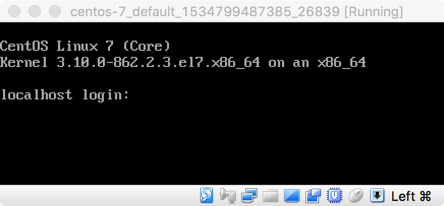

# Introduction to Securing (Virtualized) Secure Shell Servers

[Secure Shell (SSH)](https://simple.wikipedia.org/wiki/Secure_Shell) is an encrypted network protocol originally developed in 1995. Since the 90’s, SSH has been a cornerstone of remote administration. It’s one of the first and still one of the most important tools any system administrator must learn to use. The most widely known use of SSH is its application as a remote login tool. The SSH protocol provides the operator of a computer system a secure channel over an unsecured network (like the Internet) to use to access the command line of a remote system, although any network-capable service can be secured using the SSH protocol.

To learn SSH, you need at least two computers talking to each other: one playing client (the administrator's workstation or laptop), and one playing server (the remote system that the admin wants to log in to from afar). These days, multi-machine setups like this are easy to create using the magic of [Virtual Machine (VM)](https://simple.wikipedia.org/wiki/Virtual_machine) hypervisors, which can create many (virtual) machines in just a few clicks. Sometimes referred to as a [“Virtual Private Cloud” (VPC)](https://en.wikipedia.org/wiki/Virtual_private_cloud), these lab environments offer completely free and astonishingly powerful educational and operational opportunities.

This workshop presents a brief crash course in configuring and hardening SSH. Along the way, we’ll also touch on some basics of spinning up a simple VPC using the free and open source [VirtualBox](https://en.wikipedia.org/wiki/VirtualBox) type-2 [hypervisor](https://en.wikipedia.org/wiki/Hypervisor) and the [Vagrant](https://en.wikipedia.org/wiki/Vagrant_%28software%29) hypervisor automation utility. We’ll have to create both the machines themselves and their virtualized network environment, so we'll cover some basic network engineering concepts as well. Finally, we’ll dig into the gritty of hardening (securing) your SSH server and client configurations so you can let your comrades in and keep [the CIA](https://www.ssh.com/ssh/cia-bothanspy-gyrfalcon) out.

# Contents

1. [Objectives](#objectives)
1. [Bill of materials](#bill-of-materials)
1. [Prerequisites](#prerequisites)
1. [Set up](#set-up)
    1. [VirtualBox installation](#virutalbox-installation)
        1. [VirtualBox installation on Windows](#virtualbox-installation-on-windows)
        1. [VirtualBox installation on macOS](#virtualbox-installation-on-macos)
        1. [VirtualBox installation on GNU/Linux](#virtualbox-installation-on-gnulinux)
        1. [VirtualBox installation on FreeBSD](#virtualbox-installation-on-freebsd)
        1. [VirtualBox installation on Solaris](#virtualbox-installation-on-solaris)
    1. [Vagrant installation](#vagrant-installation)
        1. [Vagrant installation on Windows](#vagrant-installation-on-windows)
        1. [Vagrant installation on macOS](#vagrant-installation-on-macos)
        1. [Vagrant installation on GNU/Linux](#vagrant-installation-on-gnulinux)
        1. [Vagrant installation on FreeBSD](#vagrant-installation-on-freebsd)
        1. [Vagrant installation on Solaris](#vagrant-installation-on-solaris)
    1. [Vagrantfile creation](#vagrantfile-creation)
    1. [Virtual machine startup](#virtual-machine-startup)
    1. [Virtual machine operation](#virtual-machine-operation)
    1. [Network connectivity checking](#network-connectivity-checking)
    1. [VirtualBox DHCP server configuration](#virtualbox-dhcp-server-configuration)
1. [Practice](#practice)
    1. [Introduction](#introduction)
1. [Discussion](#discussion)
    1. [Vagrant multi-machine](#vagrant-multi-machine)
    1. [VirtualBox networking modes](#virtualbox-networking-modes)
    1. [Network interfaces in GNU/Linux](#network-interfaces-in-gnulinux)
    1. [IPv6 addressing](#ipv6-addressing)
    1. [DHCP options](#dhcp-options)
1. [Additional references](#additional-references)

# Objectives

When you complete this lab, you will have acquired the following capabilities:

* The ability to use Vagrant to create VirtualBox-backed virtual machines.
* The ability to perform basic configuration and troubleshooting of VirtualBox-backed virtual networks.
* The ability to audit SSH server and client configuration files to spot potential security weaknesses and prove that these hardened configurations are in effect on both server and client endpoints.
* The ability to log in to an SSH server using SSH's public key-based ("passwordless") authentication mechanism.

To successfully complete this lab, you will need to construct a virtualized network that matches the diagram shown below. We suggest that you refer to this diagram throughout this practice lab to check your understand of the material presented herein.


# Bill of materials

This folder contains the following files and folders:

* `README.md` - This file.
* `Screenshots/` - Contains images used to augment the lab's textual material; these are not directly related to the lab's practice steps.
* `Virtualized Network Topology.svg` - A Scalable Vector Graphics image file displaying the desired network topology for this lab.
* `Virtualized Network Topology.xml` - An editable [Draw.IO](https://draw.io/) diagram that can be exported as SVG to produce the `Virtualized Network Topology.svg` image file.
* `centos-7/` - Used for the CentOS 7 Vagrant VM.
    * `Vagrantfile` - The Vagrant configuration for the CentOS 7 virtual machine.
* `ubuntu-xenial64/` - Used for the Ubuntu Xenial 64  Vagrant VM.
    * `Vagrantfile` - The Vagrant configuration for the Ubuntu Xenial64 virtual machine.

# Prerequisites

To perform this lab, you must have:

* A computer running any modern version of:
    * Windows,
    * macOS,
    * FreeBSD,
    * Solaris, or
    * any flavor of the GNU/Linux operating system.
* An active Internet connection (for downloading the required tools in the [set up](#set-up) step, as well as Vagrant base boxes, and the required software packages into the virtual machines; you do not need an Internet connection once you have completed the set up portion of this lab).

> :beginner: :computer: This exercise requires the use of a command line, or "terminal." If you don't know what that means, or if you do but you feel intimidated by that, consider spending an hour at [Codecademy's interactive tutorial, "Learn the Command Line"](https://www.codecademy.com/learn/learn-the-command-line) (for macOS or GNU/Linux users) or reviewing [Computer Hope's article, "How to use the Windows command line (DOS)"](http://www.computerhope.com/issues/chusedos.htm) (for Windows users) if you want to get started quickly. You don't need to complete the whole tutorial or article to understand this exercise, but it will dramatically improve your comprehension of this exercise's mechanics. If you want a more thorough but equally gentle introduction to the same material, consider reading (and listening to) [Taming the Terminal](https://www.bartbusschots.ie/s/blog/taming-the-terminal/).

# Set up

In addition to your laptop or desktop computer, you will need to acquire the following tools.

* For managing the virtual machines: [VirtualBox](https://www.virtualbox.org/) version 5.0 or newer, sometimes written as *VBox*.
* For automatically configuring virtual machine settings: [Vagrant](https://vagrantup.com/) version 2.1 or newer.
    * [Ruby](https://www.ruby-lang.org/), required by Vagrant.

There are pre-built versions of the VirtualBox hypervisor software for Windows, macOS, GNU/Linux, and Solaris available for download from the [VirtualBox downloads page](https://www.virtualbox.org/wiki/Downloads). Your operating system's package repositories may also include a copy of VirtualBox, but be certain to double-check the version available there before installing it to ensure you are using a new-enough version of the software. For [FreeBSD users, VirtualBox is provided as a package or a source port and can be installed by following the instructions in the FreeBSD Handbook, §21.6](https://www.freebsd.org/doc/handbook/virtualization-host-virtualbox.html).

Similarly, there are pre-built versions of Vagrant for Windows, macOS, and numerous different GNU/Linux flavors available from the [Vagrant downloads page](https://www.vagrantup.com/downloads.html). [Vagrant is also provided as a FreeBSD port](https://svnweb.freebsd.org/ports/head/sysutils/vagrant/). Solaris users can [install Vagrant by installing from source](https://www.vagrantup.com/docs/installation/source.html).

## VirtualBox installation

In most cases, VirtualBox can be easily installed by [downloading the appropriate pre-built package](https://www.virtualbox.org/wiki/Downloads) for your operating system and hardware architecture and following the standard installation procedure as you would any other software. This section provides additional guidance for installing VirtualBox, and offers advice to troubleshoot installation problems.

### VirtualBox installation on Windows

> :construction: TK-TODO

### VirtualBox installation on macOS

> :construction: TK-TODO

### VirtualBox installation on GNU/Linux

> :construction: TK-TODO

### VirtualBox installation on FreeBSD

> :construction: TK-TODO

### VirtualBox installation on Solaris

> :construction: TK-TODO

## Vagrant installation

In most cases, Vagrant can be easily installed by [downloading the appropriate pre-built package](https://vagrantup.com/downloads.html) for your operating system and hardware architecture and following the standard installation procedure as you would any other software. This section provides additional guidance for installing Vagrant, and offers advice to troubleshoot installation problems.

### Vagrant installation on Windows

> :construction: TK-TODO

### Vagrant installation on macOS

> :construction: TK-TODO

### Vagrant installation on GNU/Linux

> :construction: TK-TODO

### Vagrant installation on FreeBSD

> :construction: TK-TODO

### Vagrant installation on Solaris

> :construction: TK-TODO

## Vagrantfile creation

Once VirtualBox is installed and running, you can manually create a new virtual machine by using the VirtualBox Manager graphical user interface (GUI) application, described in [the VirtualBox Manual §1.7](https://www.virtualbox.org/manual/ch01.html#idm272). Setting up a new virtual machine through the graphical interface typically requires many clicks, and can take a considerable amount of time. Vagrant is used to automate this process so that a virtual machine with a given configuration is accessible to you in mere moments.

To accomplish this, Vagrant reads files that describe various aspects of a virtual machine. These aspects range from what hardware to virtualize (e.g., how many network adapters the virtual machine should have, or how much memory should be installed into it), to what commands should be run when the virtual machine boots up for the first time (e.g., which software packages to install to prepare it for a given use). All of this information is contained within [a file literally named `Vagrantfile`](https://www.vagrantup.com/docs/vagrantfile/).

> :beginner: The `Vagrantfile`s for both the server and client virtual machines have already been created for you. If you are not interested in learning some Vagrant basics right now, you can download these files, place them inside two sibling folders manually, and then continue to the [Practice](#practice) section of this lab. The two files you'll need are [`centos-7/Vagrantfile`](centos-7/Vagrantfile) and [`ubuntu-xenial64/Vagrantfile`](ubuntu-xenial64/Vagrantfile). Read this section to learn how we created these files and what their contents describe.

A single `Vagrantfile` is intended to describe a complete Vagrant *project*. When Vagrant finds a `Vagrantfile`, the folder in which the `Vagrantfile` is found is considered the Vagrant *project root*. For the purposes of this lab, we will be using separate Vagrant projects for each virtual machine. This means we will be creating two `Vagrantfile`s, one for the SSH server and the other for our SSH client.

> :bulb: A single `Vagrantfile` can actually describe the configuration of multiple virtual machines. See the [Vagrant multi-machine](#vagrant-multi-machine) discussion for more information on this Vagrant feature. If you are already comfortable with Vagrant, consider re-writing our multiple `Vagrantfile`s as a single multi-machine `Vagrantfile`, instead.

Since a Vagrant project must contain a `Vagrantfile`, we will need to make a folder to house that file. Inside that new folder, we must write a `Vagrantfile` that describes the configuration of the first of our two machines. Then we'll repeat the process to describe our desire for the second of our two machines. This lab is written to use GNU/Linux [CentOS](https://centos.org/) 7 for the server and GNU/Linux [Ubuntu](https://ubuntu.com/) 16 (codenamed "Xenial") as the client. In theory, you could use any operating systems you want, and we encourage you to try out other operating systems after you complete this lab.

Vagrant's main command line utility (`vagrant`) offers a number of convenience functions to help us write these `Vagrantfile`s. We'll use [the `vagrant init` command](https://www.vagrantup.com/docs/cli/init.html) for this purpose. Let's create our Vagrant virtual machine configurations now.

**Do this:**

1. Create a new folder named `centos-7`.
1. In the `centos-7` folder, create a new file named `Vagrantfile` that contains a Vagrant configuration for a CentOS 7 virtual machine:
    ```sh
    vagrant init --minimal --output centos-7/Vagrantfile centos/7
    ```
1. Alongside the first folder, create a second folder named `ubuntu-xenial64`.
1. In the `ubuntu-xenial64` folder, create a new file named `Vagrantfile` that contains a Vagrant configuration for an Ubuntu Xenial virtual machine:
    ```sh
    vagrant init --minimal --output ubuntu-xenial64/Vagrantfile ubuntu/xenial64
    ```

The final argument to both commands (`centos/7` in the first case and `ubuntu/xenial64` in the second) map to Web addresses of pre-packaged virtual machine settings and hard disk images containing pre-installed copies of the named operating system at the specified version. These pre-packaged virtual machine environments are called [*Vagrant boxes*](https://www.vagrantup.com/docs/boxes.html). A public catalog of Vagrant boxes is available at [VagrantCloud.com](https://vagrantcloud.com/), and both [the `centos/7` Vagrant box](https://app.vagrantup.com/centos/boxes/7) as well as [the `ubuntu/xenial64` Vagrant box](https://app.vagrantup.com/ubuntu/boxes/xenial64) are listed there.

In these commands, the `--minimal` flag is optional. It merely instructs the `vagrant init` command not to include instructional comments in the written `Vagrantfile`. These comments are useful for new projects but unnecesary for this lab.

The `--output` flag is how you can tell `vagrant init` to write the `Vagrantfile` at a particular filesystem location, rather than the default. The default is simply to place the written `Vagrantfile` in the current folder. Since we wanted to write the `Vagrantfile` into the folder we just created, we specified `--output` explicitly.

At this point it would behoove you to inspect the Vagrantfiles, so open each in a text editor. Find the line that begins with `config.vm.box`. This is a variable assignment. When Vagrant loads a `Vagrantfile`, it constructs a `config` object. The `config` object has a `vm` member variable, which is also an object. [In this `vm` object, Vagrant keeps the specific settings for the virtual machine](https://www.vagrantup.com/docs/vagrantfile/machine_settings.html). In this case, the `box` variable stores the name of the Vagrant box on which this Vagrant project is based.

> :beginner: This multi-level ("nested") object construction is typical of code written in the [Ruby](https://ruby-lang.org/) programming language. In fact, a `Vagrantfile` is just a Ruby script with numerous pre-defined variables that you are expected to set as you desire. Since a Vagrantfile is just a Ruby script, the more Ruby you learn, the more your Vagrantfiles can do. If Ruby is new (and interesting) to you, we encourage you to spend some time at [Codecademy's Learn Ruby tutorial](https://www.codecademy.com/learn/learn-ruby). If you have less time, you can also [visit TryRuby to get an interactive, whirlwind tour in your Web browser](https://ruby.github.io/TryRuby/). We also like [Ruby Monsters's Ruby for Beginners guide](https://ruby-for-beginners.rubymonstas.org/).

For instance, the CentOS 7 machine's `Vagrantfile` should have a line that looks like this:

```ruby
config.vm.box = "centos/7"
```

Meanwhile, the Ubuntu Xenial machine's `Vagrantfile` should have a similar line, but the `config.vm.box` variable should be assigned a different value:

```ruby
config.vm.box = "ubuntu/xenial64"
```

On the left side of the equals sign (`=`) is the full name of the variable (`config.vm.box`). The equals sign is Ruby's assignment operator, which takes the value to the right of the equals sign and saves it to the variable named on the left. After Vagrant reads this line in your `Vagrantfile`, Vagrant will know which box you want to use in your project.

Every virtual machine that Vagrant configures always has at least one network adapter. [For VirtualBox, this first network adapter and its configuration is hard-coded and cannot be changed](https://www.vagrantup.com/docs/virtualbox/boxes.html#virtual-machine). (Well, not without changing the source code for Vagrant itself, anyway). Vagrant always configures this adapter to use [VirtualBox's `NAT` networking mode](https://www.virtualbox.org/manual/ch06.html#network_nat). In this mode, the virtual machine is able to access the Internet through the physical (host) machine's own network connection, but no other machines can access it because it is placed behind a virtual [Network Address Translation (NAT)](https://simple.wikipedia.org/wiki/Network_address_translation) router of its own.

> :beginner: In addition to virtualizing "machine" hardware, VirtualBox (and most other hypervisors) can also virtualize *network* devices, including routers, switches, and even some network services, in order to create a network environment in which the virtual machine can operate. A full discussion of network engineering is beyond the scope of this lab, but see the [VirtualBox networking modes](#virtualbox-networking-modes) discussion section, below, for additional information. For now, suffice it to say that without correctly configuring a second network adapter to your VirtualBox-backed and Vagrant-configured virtual machine, no other virtual machine will be able to communicate directly with it.

In order for our two virtual machines to be able to hear one another when they speak, they need to be connected to the same network. To accomplish this, we can instruct Vagrant to instruct VirtualBox to add a second virtualized [network interface card (NIC)](https://en.wikipedia.org/wiki/Network_interface_controller) to each machine and to connect both machines's second NIC to the same virtualized network. To have Vagrant add subsequent NICs to a virtual machine, we use [the `config.vm.network` method](https://www.vagrantup.com/docs/networking/basic_usage.html) call.

> :beginner: A *method*, in programmer-speak, is a function that an object can perform. In Ruby, everything is an object, so all functions are technically methods. In our case, the `config.vm` object is, as stated, an object, and `network` is the name of one of the `vm` object's functions. This is the method Vagrant uses to configure virtualized NIC hardware on the virtual machine. What a method or function actually does depends on the *arguments* given (or "passed") to it.

Each time we call the `config.vm.network` method, Vagrant tries adding another NIC to the virtual machine it's building for us. We'll want to ensure that our second NIC is not accessible by the outside world, so we'll pass [`"private_network"`](https://www.vagrantup.com/docs/networking/private_network.html) as the first [(positional) argument](https://ruby-doc.org/core-2.0.0/doc/syntax/calling_methods_rdoc.html#label-Positional+Arguments) to the method. Further, we want to have Vagrant configure the virtual machine's operating system to automatically configure an IP address for that network interface, so we'll also pass `type: "dhcp"` as a [keyword argument](https://ruby-doc.org/core-2.0.0/doc/syntax/calling_methods_rdoc.html#label-Keyword+Arguments). Finally, we don't just want to attach the network interface card to any random network, but a specific network, so we'll give this network a name, say `sshtestnet`, by passing `virtualbox__intnet: "sshtestnet"` as another keyword argument. The full method call will look like this:

```ruby
config.vm.network "private_network", type: "dhcp", virtualbox__intnet: "sshtestnet"
```

> :beginner: While the `sshtestnet` (part of the `virtualbox__intnet` keyword argument) is arbitrary—it merely needs to be the same for both `Vagrantfile`s—the `type: "dhcp"` keyword argument is not. It refers to the [Dynamic Host Configuration Protocol](https://simple.wikipedia.org/wiki/Dynamic_Host_Configuration_Protocol). DHCP is a way that network administrators can automatically inform machines joining their network what networking parameters they should use in order to have access to network services, not least of which is acess to the Internet. You may not have heard about it before, but you probably use DHCP every time you connect to a Wi-Fi network. We describe the use and purpose of DHCP in the [VirtualBox DHCP server configuration](#virtualbox-dhcp-server-configuration) section, a little further on in this lab set up guide.

Both of our `Vagrantfile`s will need this same line, and by including this same line in both projects, both virtual machines will be attached to the same virtual network.

**Do this**:

1. Open the `Vagrantfile` for your CentOS 7 Vagrant project in a text editor.
1. Add the `config.vm.network` method call as described above inside the configuration block (i.e., immediately following the `config.vm.box` line), then save the file.
1. Repeat the first two steps for your Ubuntu Xenial Vagrant project, as well.

Your Vagrant projects are now configured. :)

## Virtual machine startup

With your `Vagrantfile`s written, you're ready to start up the virtual machines they describe. A number of additional things happen the very first time you turn on the virtual machines in a Vagrant project. This may include downloading their Vagrant boxes from the Internet as well as performing Vagrant's own initial setup of the virtual machine's operating system and user accounts. This often means that the first time you boot a virtual machine with Vagrant it can take a bit more time to complete than it will on subsequent startups.

To power on a virtual machine described in a `Vagrantfile` for the first time, you must first be somewhere within the Vagrant project. Then, you invoke [the `vagrant up` command](https://www.vagrantup.com/docs/cli/up.html). This instructs Vagrant to look for a `Vagrantfile` in the current directory, or continue [searching up the filesystem hierarchy in subsequent directories](https://www.vagrantup.com/docs/vagrantfile/#lookup-path) if a `Vagrantfile` is not in the current directory. We'll do this twice; once to start up our CentOS 7 virtual machine, and a second time to start up our Ubuntu Xenial virtual machine. The order in which you boot the virtual machines doesn't particularly matter, but you will eventually need both virtual machines powered on to complete this practice lab.

**Do this**:

1. In your terminal, change to the directory of your CentOS 7 virtual machine:
    ```sh
    cd centos-7
    ```
1. Power on the virtual machine:
    ```sh
    vagrant up
    ```
1. Wait until the first virtual machine has finished booting. Vagrant will display quite a bit of output during this process. If this is your first time booting a Vagrant virtual machine, take a minute to read some (or all!) of this output.
1. When the first machine has finished booting, change to the directory of your Ubuntu Xenial virtual machine and power on that virtual machine as well:
    ```sh
    cd ../ubuntu-xenial64
    vagrant up
    ```

If successful, you should now have the two virtual machines running on the VirtualBox hypervisor. You can check that this is so by invoking [the `vagrant status` command](https://www.vagrantup.com/docs/cli/status.html) from within one of the Vagrant project directories. Alternatively, you can invoke [the `vagrant global-status` command](https://www.vagrantup.com/docs/cli/global-status.html) to see the current status of all your Vagrant projects in one list, regardless of your current working directory.

> :beginner: As you might expect, Vagrant can also shut down virtual machines, not just start them up. The command for this is [`vagrant halt`](https://www.vagrantup.com/docs/cli/halt.html). Additionally, Vagrant can also interface with numerous VirtualBox features such as [snapshots](https://www.virtualbox.org/manual/ch01.html#snapshots) (via [the `vagrant snapshot` command](https://www.vagrantup.com/docs/cli/snapshot.html)) and [saving or restoring the running state of the virtual machine](https://www.virtualbox.org/manual/ch01.html#idm485) (via [the `vagrant suspend`](https://www.vagrantup.com/docs/cli/suspend.html) and [`vagrant resume`](https://www.vagrantup.com/docs/cli/resume.html) commands, respectively). We strongly encourage you to peruse the excellent [Vagrant CLI documentation](https://www.vagrantup.com/docs/cli/) to learn more about what you can do using Vagrant's command-line interface.
>
> Importantly, when you're well and truly done with your Vagrant project or this practice lab, you'll want to use [the `vagrant destroy` command](https://www.vagrantup.com/docs/cli/destroy.html). This will delete the virtual machines defined in your `Vagrantfile` in their entirety, reclaiming your physical (host) machine's hard disk space and generally cleaning up after yourself.

Another way to check that your virtual machines are, in fact, powered on is simply to open the graphical VirtualBox Manager application. You should see that both virtual machines are now registered with VirtualBox and are shown to be in the "Running" state. Once both of the practice lab's virtual machines are up and running, you can continue to the next section.

## Virtual machine operation

> :beginner: A quick note on terminology: when discussing the relationship between a physical machine and a virtual machine, we say that the physical machine is the *host* machine and the virtualized machine is its *guest*. This is because the virtual machine (guest) is, ultimately, sharing resources with the underlying physical machine; it is at the mercy of its host. In this lab, we take care to make this distinction as clear as possible, though you will often hear the terms *host* and *guest* without much additional context.

In order to complete this lab, we must first be able to operate within the context of virtual machine itself. Put another way, we need to leave our physical machine and enter the virtual machine. We can do this in one of two ways.

* Use VirtualBox to bring up a simulated video display and keyboard plugged directly into the VM's virtualized hardware.
* Use the SSH facility provided by Vagrant to access a command shell running in the VM's operating system.
    > :beginner: Yes, it's a little ironic that Vagrant already provides an SSH facility for us to use. This is in fact the same SSH facility that we will be hardening. Not to worry, though! All this means is that we won't need to *install* the SSH software ourselves, since all Vagrant boxes already package SSH as part of their base box. This, like the first network adapter, is a hard requirement of all Vagrant boxes since Vagrant itself uses SSH to remotely administer the virtual machine. In fact, commands like `vagrant halt` are simply shortcuts for opening an SSH connection to your virtual machine and issuing the `shutdown(1)` command (or an equivalent, if the virtual machine is not running an operating system for which `shutdown` is a recognized command).

It's useful to know about both of these methods because it's very possible that you will nullify your ability to use the second method (Vagrant's SSH facility) if you make certain errors during this practice lab. In case you do, you'll still be able to use the first method (the direct VirtualBox console) to recover. Your third option, of course, is to start over (discarding all your progress) by using [the `vagrant destroy` command](https://www.vagrantup.com/docs/cli/destroy.html).

Let's showcase the VirtualBox console first, and then try out Vagrant's (arguably more comfortable) SSH facility.

**Do this:**

1. Launch the graphical VirtualBox Manager application if it is not already opened as described in [§1.7, "Starting Virtual" of the VirtualBox Manual](https://www.virtualbox.org/manual/ch01.html#idm272).
1. Look for two virtual machines in the list on the left-hand sidebar of the main "Oracle VM VirtualBox Manager" window with names that begin with `centos-7_default` and `ubuntu-xenial64_default` and end in numbers. These are the virtual machines Vagrant created for you.
    > :beginner: The numbers in your Vagrant virtual machine names are timestamps that indicate when the virtual machine was created. You can customize the name that Vagrant gives to a VirtualBox virtual machine by adding [a special, VirtualBox-specific variable in your `Vagrantfile`](https://www.vagrantup.com/docs/virtualbox/configuration.html#virtual-machine-name). Without this special variable, Vagrant defaults to using the name of the folder containing the `Vagrantfile` with `_default_` and a timestamp appended to it as the name of the VirtualBox VM.
1. Double-click on one of the Vagrant virtual machines in the list. This will open a new window whose contents is the video output of the virtual machine's display.
1. Click once inside the window (which may be blank, or all black) to let VirtualBox *capture* your keyboard and mouse movements. VirtualBox will now route all your keyboard presses and mouse movements to the input of the virtual machine and away from your physical computer.
1. Press the `Enter` or `Return` key on your keyboard. Eventually, your virtual machine will notice the input and display a login prompt, as shown below:  
    
1. At either login prompt, type `vagrant` as the username, then press `Return`.
1. At the password prompt, type `vagrant` as the password, then press `Return`. Unlike the username prompt, the password you type will not be echoed back to your screen.

You should now be logged in to a command shell inside the virtual machine, as shown below:


This method of accessing your virtual machine emulates having a physical keyboard, video monitor, and possibly also a mouse directly attached to the virtual machine. The window that VirtualBox presents to you is the output of the virtual machine's video card. Your keyboard and mouse or trackpad is routing its input directly to the virtual machine. It's as though you have physically sat down in front of the machine itself.

Using the VirtualBox Manager in this manner means no network connections are involved. In fact, your virtual machine doesn't even need to have a network adapter installed for this to function. If you are ever unable to access your virtual machine using a network connection (like SSH), you can still control it through this emulated physical connection. You might hear this method described as a *direct console*, *serial console*, or *physical console*.

> :beginner: In order to disconnect your physical keyboard and mouse from the virtual machine and return to using your host computer normally, VirtualBox watches for any press of a special key it calls the *host key*. On most computers, this is the right Control key. On macOS computers, it is the left Command key. Learn more about [capturing and releasing keyboard and mouse input in §1.9.2 of the VirtualBox Manual](https://www.virtualbox.org/manual/ch01.html#keyb_mouse_normal).

Now that you can reliably control your virtual machine regardless of network connectivity, let's try using Vagrant's SSH facility to do the same thing.

**Do this:**

1. Release your keyboard and mouse from the virtual machine by pressing the VirtualBox host key. On most host machines, this is the right Control key. On macOS hosts, it is the left Command key.
1. From the *Machine* menu, choose *Detach GUI*. This will close the window showing the virtual machine's monitor without shutting down the virtual machine itself.
1. Return to your host terminal.
1. Navigate to the `centos-7` folder.
1. Use Vagrant to make an SSH connection and remotely log in to the CentOS 7 virtual machine using [the `vagrant ssh` command](https://www.vagrantup.com/docs/cli/ssh.html). If successful, you should see output similar to the following snippet:
    ```sh
    you@your-host$ vagrant ssh
    Last login: Tue Aug 21 22:26:15 2018
    [vagrant@localhost ~]$
    ```
1. Confirm that you are now remotely logged in to the virtual machine and have assumed the `vagrant` user identity by issuing a command such as `whoami(1)` or `who(1)`. For example:
    ```sh
    [vagrant@localhost ~]$ whoami
    vagrant
    [vagrant@localhost ~]$ who
    vagrant  tty1         2018-08-21 22:26
    vagrant  pts/0        2018-08-21 22:56 (10.0.2.2)
    [vagrant@localhost ~]$
    ```

You are now at the command line of the CentOS 7 virtual machine. Using `vagrant ssh` from a Vagrant project directory, you can immediately access the command line of the virtual machine using the pre-provisioned SSH server that came as part of the Vagrant box and the first (NAT'ed) network adapter that Vagrant instructs VirtualBox to attach to the virtual machine. The next step is to ensure that your two virtual machines can communicate with one another through the second network interface card that you configured in their respective `Vagrantfile`.

## Network connectivity checking

Recall that the purpose of SSH is to securely access one computer from a second. This implies that the two computers must be able to send messages to and receive messages from one another, whether secured or not. If the two computers can't interact for any reason, then whether you have hardened your SSH session is a moot point, since you cannot make use of the SSH protocol in the first place. Therefor, before we even concern ourselves with SSH, we need to ensure that the one machine is able to contact the other, and vice versa.

Further, in order for one machine to send a message to another, it must have the name of the place at which the intended recipient can be found. This name is called an *address*. At this fundamental level, computer addresses work exactly the same way as postal addresses. If you've ever sent a postcard to a family member or friend while on vacation, you've written an address. Likewise, if you've ever sent an email to a coworker, chatted with a friend on Facebook, or placed a telephone call, you've used an address to direct the message towards your recipient. Postcards use *mailing addresses*, Facebook chats use Facebook *user names*, e-mails use *email addresses*, and telephone calls use *telephone numbers*. These are all examples of addresses.

In many modern digital networks (like the Internet), the "place" in the network at which a given machine can be found is an address called an *[Internet Protocol (IP)](https://simple.wikipedia.org/wiki/Internet_Protocol) address*. In order for our virtual machines to be able to communicate with one another, both of them need to have their own IP address. When one sends a message to the other, it will write its own IP address on the message's envelope in the *source IP* field and, unsurprisingly, it will write the IP address of its intended recipient on the message's envelope in the *destination IP* field. These message envelopes are called *packet headers*.

> :beginner: :bulb: If you think about it, of course, it's not enough merely to give two machines addresses. These addresses need to be *routable* between each other. That is, there needs to be an unbroken pathway from point A (the source) to point B (the destination), which further means each intermediary device handling their messages can forward them in the appropriate direction. Internetwork routing is beyond the scope of this lab, but have a look at [Henrik Frystyk's excellent (and superbly brief) *Introduction to the Internet*](https://www.w3.org/People/Frystyk/thesis/Internet.html), circa 1994, for more information. His article also lists references that, while old, are still profoundly relevant today.

In this lab, both virtual machines are connected to two different networks: the NAT network required by Vagrant connects the virtual machine to the Internet, and the VirtualBox internal network we named `sshtestnet` is intended to allow the virtual machines to communicate with one another. It is our connections to this second network that we will be examining more closely.

**Do this:**

1. Log in to the CentOS 7 virtual machine using `vagrant ssh` if you have not already done so.
1. Look up the current IP network address configurations of the virtual machine by invoking [the `ip address` command](https://explainshell.com/explain?cmd=ip+address). You will see a readout showing you information about each of the machine's IP network devices and the current state of each of them:
    ```sh
    $ ip address
    1: lo: <LOOPBACK,UP,LOWER_UP> mtu 65536 qdisc noqueue state UNKNOWN group default qlen 1000
        link/loopback 00:00:00:00:00:00 brd 00:00:00:00:00:00
        inet 127.0.0.1/8 scope host lo
           valid_lft forever preferred_lft forever
        inet6 ::1/128 scope host
           valid_lft forever preferred_lft forever
    2: eth0: <BROADCAST,MULTICAST,UP,LOWER_UP> mtu 1500 qdisc pfifo_fast state UP group default qlen 1000
        link/ether 52:54:00:c9:c7:04 brd ff:ff:ff:ff:ff:ff
        inet 10.0.2.15/24 brd 10.0.2.255 scope global noprefixroute dynamic eth0
           valid_lft 85862sec preferred_lft 85862sec
        inet6 fe80::5054:ff:fec9:c704/64 scope link
           valid_lft forever preferred_lft forever
    3: eth1: <BROADCAST,MULTICAST,UP,LOWER_UP> mtu 1500 qdisc pfifo_fast state UP group default qlen 1000
        link/ether 08:00:27:aa:0a:e6 brd ff:ff:ff:ff:ff:ff
        inet6 fe80::a00:27ff:feaa:ae6/64 scope link
           valid_lft forever preferred_lft forever
    ```
    > :beginner: If you're not familiar with IP internetwork routing, the amount of information presented here can feel overwhelming. Don't worry, though, we'll only be concerning ourselves with a few important bits. These are:
    >
    > * The *logical device name*. In the output above, we see three devices. The first is named `lo`, the second is named `eth0`, and the third is named `eth1`. You can see this in the lines that begin with `1: lo`, `2: eth0`, and `3: eth1`.
    > * The IP address assigned to the named device. In this case, the `lo` device has the IP address `127.0.0.1/8`, the `eth0` device has the IP address `10.0.2.15/24`, and the `eth1` device doesn't have an IP address at all. You can see this in the indented lines that start with `inet`. Note that the third device's indented block does not have a line that begins with `inet` at all.
    >
    > Each of these devices corresponds to a (virtualized, in our case) hardware network adapter installed in the virtual machine, or a virtual network interface, such as the `lo` device in this example. Yes, that's a virtual network interface in a virtual machine. For more information about network devices, see the [Network interfaces in GNU/Linux](#network-interfaces-in-gnulinux) discussion section.
    >
    > Finally, note that each of the IP addresses end with a forward slash (`/`) and another number. The number following the forward slash is called a *network mask* or *netmask* for short. The forward slash itself indicates a particular notation called [Classless Inter-Domain Routing (CIDR)](https://en.wikipedia.org/wiki/Classless_Inter-Domain_Routing) notation. We'll cover netmasks shortly but, for now, all you need to know is that reading netmasks correctly is an important part of determining how, and if, two machines can route messages to each other. When reading IP addresses, remember to look at the netmask as well!
    >
    > :beginner: :bulb: In the output shown by the `ip address` command, lines starting with `inet` denote Internet Protocol version 4 information. There is another, newer version of the Internet Protocol called [IP version 6, or IPv6](https://en.wikipedia.org/wiki/IPv6) for short. Information about a machine's IPv6 addresses is also shown by the `ip address` command on lines that start with `inet6`. A network adapter can have an IPv4 and an IPv6 address at the same time. You'll see that IPv6 addresses look different than IPv4 addresses: they use hexadecimal numbers separated by a colon, instead of decimal numbers separated by a dot, but both versions still end with a forward slash and a decimal number to denote the address's netmask. For the purposes of this lab, we won't be dealing with IPv6 at all, but have a look at the [IPv6 addressing](#ipv6-addressing) discussion section for more information about the differences between IPv4 and IPv6.
1. Exit the virtual machine by using [the `exit` command](https://explainshell.com/explain?cmd=exit). This will return you to your host operating system.
1. Log in to the Ubuntu Xenial virtual machine and investigate its IP address configuration by using the `ip address` command again. You'll see similar but probably not identical output as you did on CentOS:
    ```sh
    $ ip address
    1: lo: <LOOPBACK,UP,LOWER_UP> mtu 65536 qdisc noqueue state UNKNOWN group default qlen 1
        link/loopback 00:00:00:00:00:00 brd 00:00:00:00:00:00
        inet 127.0.0.1/8 scope host lo
           valid_lft forever preferred_lft forever
        inet6 ::1/128 scope host
           valid_lft forever preferred_lft forever
    2: enp0s3: <BROADCAST,MULTICAST,UP,LOWER_UP> mtu 1500 qdisc pfifo_fast state UP group default qlen 1000
        link/ether 02:48:3e:15:b5:0c brd ff:ff:ff:ff:ff:ff
        inet 10.0.2.15/24 brd 10.0.2.255 scope global enp0s3
           valid_lft forever preferred_lft forever
        inet6 fe80::48:3eff:fe15:b50c/64 scope link
           valid_lft forever preferred_lft forever
    3: enp0s8: <BROADCAST,MULTICAST,UP,LOWER_UP> mtu 1500 qdisc pfifo_fast state UP group default qlen 1000
        link/ether 08:00:27:62:c4:26 brd ff:ff:ff:ff:ff:ff
        inet6 fe80::a00:27ff:fe62:c426/64 scope link
           valid_lft forever preferred_lft forever
    ```
    > :beginner: Did you notice the difference in these device names? For example, it was `eth1` on CentOS 7 but is `enp0s8` on Ubuntu Xenial. The `eth` prefix is a historical abbreviation for *[ethernet](https://simple.wikipedia.org/wiki/Ethernet)*, the lower-level networking technology on which many IP networks still depend. In contrast, `enp` stands for *ethernet network peripheral*. See the [Predictable Network Interface Names page on the Freedesktop Project's wiki](https://www.freedesktop.org/wiki/Software/systemd/PredictableNetworkInterfaceNames/) for details about these naming choices.

Astute readers will no doubt have noticed that `eth0` on the CentOS machine and `enp0s3` on the Ubuntu machine both have the same IP address. This is because both devices are set to use VirtualBox's NAT [networking mode](#virtualbox-networking-modes). These devices are attached to completely separated networks and can therefore have the same IP address without conflicting with one another. This is like two people sharing the same name, but being in totally different conversations. No one will be confused about who is being referred to by the name "Alex" if there is only one Alex in the room.

If your IP address configurations look like the above, there is an obvious problem: the two virtual machines cannot yet communicate with one another. This is because VirtualBox has not given them IP addresses to use while on the `sshtestnet` internal network. To resolve this situation, we need to instruct VirtualBox to start doling out IP addresses to machines that are connected to this named internal network.

## VirtualBox DHCP server configuration

When a machine first joins a network, it doesn't necessarily have an IP address. Among other issues, this means it won't be able to receive messages from other machines, since no other machine knows how to address their messages to it. This is the dilemma that the [Dynamic Host Configuration Protocol (DHCP)](https://simple.wikipedia.org/wiki/Dynamic_Host_Configuration_Protocol) was designed to solve.

A DHCP server, then, is typically a machine that has joined a network ahead of time and is ready to assign IP addresses to new machines as they join the network after it has. These late comers are called *DHCP clients*. DHCP services could be offered by an entirely separate, wholly dedicated machine attached to the network, or they could be offered by any other machine running DHCP server software. For example, in a small home network, the Wi-Fi router probably has a DHCP server running on it. By using DHCP, you can avoid the need to manually configure the IP network settings of each device that wants to use the network each time that device joins the network.

> :beginner: :bulb: DHCP is not limited to assigning IP addresses. It can be used to automatically configure all sorts of network settings, such as the address of upstream DNS servers, network boot images, and more. See the [DHCP options](#dhcp-options) discussion section for more information about the network settings that DHCP can automatically configure.

Much like your home Wi-Fi router, VirtualBox itself has the ability to offer DHCP services to any of the networks it virtualizes. We'll be using this VirtualBox feature to ensure that the virtual machines on the `sshtestnet` network have IP addresses. Using [the `VBoxManage list dhcpservers` command](https://www.virtualbox.org/manual/ch08.html#vboxmanage-list), you can see all the DHCP servers that VirtualBox has added to its virtualized networks.

> :beginner: The `VBoxManage(1)` command is the command-line equivalent of the VirtualBox Manager graphical application you used earlier. Everything that can be accomplished with the graphical point-and-click application can be accomplished with the `VBoxManage` command line, and then some. Each `VBoxManage` command takes a subcommand (such as `list` in the example above), which then may take additional options and arguments. Use the `--help` option to get a quick reference guide for how to use `VBoxManage`. For example, `VBoxManage --help` will show you a usage reference for every `VBoxManage` subcommand, while `VBoxManage list --help` will show you the usage reference just for the `VBoxManage list` subcommand. [Chapter 8 of the VirtualBox Manual](https://www.virtualbox.org/manual/ch08.html) covers the `VBoxManage` command in more complete detail.

**Do this:**

1. Open a terminal on your host machine.
1. Get a list of all the VirtualBox DHCP servers currently installed. Your output will look something like the snippet below, which is truncated for length and clarity:
    ```sh
    $ VBoxManage list dhcpservers
    NetworkName:    NatNetwork
    IP:             10.0.2.3
    NetworkMask:    255.255.255.0
    lowerIPAddress: 10.0.2.4
    upperIPAddress: 10.0.2.254
    Enabled:        Yes

    NetworkName:    intnet
    IP:             172.16.222.1
    NetworkMask:    255.255.255.0
    lowerIPAddress: 172.16.222.100
    upperIPAddress: 172.16.222.111
    Enabled:        Yes
    ```

In the output above, we see two of VirtualBox's default DHCP servers. (There will probably more than two in the complete output; the above is just a small snippet.) Each DHCP server listing has the same format:

* `NetworkName` displays the name of the VirtualBox network to which this DHCP server is attached. In the example above, `NatNetwork` refers to the `NAT` [VirtualBox networking mode](#virtualbox-networking-modes). This is the DHCP server from which your virtual machines received an IP address assignment when they started up the first time.
* `IP` is the IP address of the DHCP server itself. Like any other machine, the DHCP server needs an IP address so that it can communicate with other machines on the network. DHCP servers themselves typically get *static* IP addresses, which is to say, their IP addresses are assigned manually by network administrators. You'll be doing this yourself in just a moment.
* `NetworkMask` is the other important part of an IP address, and is displayed by VirtualBox in this output using the older dotted decimal notation, rather than the newer CIDR notation. A netmask of `255.255.255.0` in this older notation is equivalent to `/24` in CIDR notation.
    > :beginner: :construction: TK-TODO: More about netmasks and translating classfull to CIDR notation.
* `lowerIPAddress` is the first IP address available for DHCP clients. This is the lower bound in the range of IP addresses you'd like to make available for new machines to use as they join.
* `upperIPAddress` is the last IP address available for DHCP clients. This is the upper bound in the range of IP addresses you'd like to make available for new machines to use as they join.
    > :beginner: Taken together, the lower and upper IP address range is called an *IP address pool*. So, for example, if your lower IP address is 1.1.1.1 and your upper IP address is 1.1.1.2, you have an IP address pool consisting of two IP addresses. This means only two machines at a time will be given an IP address. If a third machine joins the same network, it must wait until one of the first two machines are done using their addresses before it will get an IP address of its own. This may take some time, hours or even days, depending on how the DHCP server is configured and how promptly the DHCP clients notify the server that they no longer need to use the IP address assigned to them.
    >
    > :construction: TK-TODO: Discuss the concept of a DHCP lease, reservation, and lease time. Describe `release`ing a DHCP lease (re-requesting a new DHCP lease), as well, which is a common command that Windows user will be familiar with: `ipconfig /renew`. GNU/Linux users will likely want to explore [the `dhclient(8)` command](https://linux.die.net/man/8/dhclient).
* `Enabled` shows whether or not the VirtualBox DHCP server is actually turned on or not. If the DHCP server is not enabled, it will of course not respond to requests for IP assignments. :)

In order to add DHCP services to our `sshtestnet` network, we merely need to instruct VirtualBox to enable a DHCP server on that named network. We do this using [the `VBoxManage dhcpserver` command](https://www.virtualbox.org/manual/ch08.html#vboxmanage-dhcpserver). If you didn't see a DHCP server listed for the `sshtestnet` network when you ran `VBoxManage list dhcpservers`, you'll need to use the `VBoxManage dhcpserver add` command to install a new DHCP server on the network. Otherwise, if you did see a DHCP server listed for the `sshtestnet` network, you can use `VBoxManage dhcpserver modify` with the exact same arguments as you would have used for the `add` invocation to edit the DHCP server's settings.

Let's configure the DHCP server for the `sshtestnet` network now.

**Do this:**

1. At a terminal on your host machine, add a new DHCP server for the `sshtestnet` network that will offer a small number of IP addresses for the virtual machines to use:
    ```sh
    VBoxManage dhcpserver add --netname sshtestnet --ip 172.16.1.1 --netmask 255.255.255.0 --lowerip 172.16.1.10 --upperip 172.16.1.20 --enable
    ```
1. If you receive an error like `VBoxManage: error: DHCP server already exists`, run the same command but replace `add` with `modify`:
    ```sh
    VBoxManage dhcpserver modify --netname sshtestnet --ip 172.16.1.1 --netmask 255.255.255.0 --lowerip 172.16.1.10 --upperip 172.16.1.20 --enable
    ```
    > :beginner: :construction: TK-TODO: Go over this command invocation in more detail.
1. Confirm that the VirtualBox hypervisor will provide DHCP services to the `sshtestnet` network by invoking `VBoxManage list dhcpservers` again. You should see a DHCP server listed in the output whose configuration matches this output:
    ```
    NetworkName:    sshtestnet
    IP:             172.16.1.1
    NetworkMask:    255.255.255.0
    lowerIPAddress: 172.16.1.10
    upperIPAddress: 172.16.1.20
    Enabled:        Yes
    ```

With the DHCP server in place and enabled, you can now instruct your virtual machines to request IP addresses from it. The easiest way to do this is simply to reboot them. Vagrant provides [the `vagrant reload` command](https://www.vagrantup.com/docs/cli/reload.html) as a shortcut for `vagrant halt` and a subsequent `vagrant up` to turn off a virtual machine and then immediately turn it back on.

**Do this:**

1. Reboot both your CentOS 7 and your Ubuntu Xenial virtual machines using Vagrant.
1. Log in to one of your virtual machines using `vagrant ssh` again.
1. Look up the IP address configuration of the virtual machine. If the VirtualBox DHCP server is configured and responding correctly, the network adapter attached to the `sshtestnet` network should now have an IP address associated with it. You can use the `ip address show dev eth1` command to show the IP address(es) assigned to the logical network interface device named `eth1`. (You'll want to replace `eth1` with the name of the device in your virtual machine; this is likely `enp0s8` in the Ubuntu Xenial guest.) Doing this on the CentOS 7 virtual machine should now show you output similar to the following:
    ```sh
    $ ip address show dev eth1
    3: eth1: <BROADCAST,MULTICAST,UP,LOWER_UP> mtu 1500 qdisc pfifo_fast state UP group default qlen 1000
        link/ether 08:00:27:aa:0a:e6 brd ff:ff:ff:ff:ff:ff
        inet 172.16.1.10/24 brd 172.16.1.255 scope global noprefixroute dynamic eth1
           valid_lft 1162sec preferred_lft 1162sec
        inet6 fe80::a00:27ff:feaa:ae6/64 scope link
           valid_lft forever preferred_lft forever
    ```

Notice the presence of the `inet` line. This readout indicates that the virtual machine has been assigned an IP address. The address itself is in the range that we configured as the IP address pool for the DHCP server to oversee, which is a good indication that the DHCP server is responding correctly.

# Practice

We'll begin by ensuring you have successfully completed the [set up](#set-up) steps. This process will also introduce the fundamentals that you need to understand to complete the rest of the exercise.

## Introduction

> :construction: TK-TODO

# Discussion

## Vagrant multi-machine

> :construction: Discuss the utility of [Vagrant's multi-machine features](https://www.vagrantup.com/docs/multi-machine/). This is a great "exercise left to the reader," since it is a relatively advanced Vagrant-specific construct and slightly tangential to SSH hardening.

## VirtualBox networking modes

Much like any other good hypervisor, in addition to virtualizing "machine" hardware such as a computer's processor, peripheral devices like a keyboard, video monitor, and graphical pointing device ("mouse"), and disk drives, VirtualBox can also virtualize *network* devices, including routers, switches, and even some network services (i.e., [DHCP](https://simple.wikipedia.org/wiki/Dynamic_Host_Configuration_Protocol) servers). VM hypervisors need this capability if they are to create a network environment in which the virtual machine can operate. Without this ability, your virtual machine would never be able to make a network connection, and wouldn't be able to do things like browse the Web or run servers for other machines to use.

Virtual networks, just like physical networks, can be constructed in a number of different ways, or configurations. These configurations are referred to as *network topologies*, because they define the way in which the various network devices and the machines on that network are interconnected. For example, one device, let's call it Device A, may be connected to only one other device, let's call it Device B. In turn, Device B might also be connected to only one other device, perhaps called Device C. A network diagram of this topology might look like this:

```
┌----------┐      ┌----------┐      ┌----------┐
| Device A | <--> | Device B | <--> | Device C |
└----------┘      └----------┘      └----------┘
```

Network topologies therefore describe the shape of a given network and the *path* a given message (called a "packet" in network engineering lingo) must take to get from one device to another. This topology, in which all devices are connected in a straight line, is called a [*bus network*](https://simple.wikipedia.org/wiki/Bus_network), and it is one of the simplest possible networks you can create. You could think of network engineering a bit like a "connect the dots" game, where the devices are the dots (sometimes also called "nodes" or "hosts") and the physical (or, in our case, virtual) network cabling are the lines connecting them.

VirtualBox provides several facilities for designing a network topology in whatever shape you like. Of these, VirtualBox's *networking modes* is the feature you'll use to connect a virtual machine to the network. Each of a virtual machine's network adapters can be configured in one (and only one) of these networking modes at a time. You can use either the [VirtualBox Manager graphical application](https://www.virtualbox.org/manual/ch01.html#idm272) or [the `VBoxManage(1)` command line utility](https://www.virtualbox.org/manual/ch08.html), installed along with the main VirtualBox hypervisor itself, to set any of a given virtual machine's available network adapters to the desired VirtualBox networking mode, as shown in the screenshot below:


For the purposes of this lab, the important networking modes you should be aware of are:

* `Not attached` - This networking mode means exactly what it says on the tin: the (virtual) network cable is unplugged!
* `NAT` - This is the networking mode required by Vagrant. The first network adapter of a VirtualBox-backed virtual machine must be set to this mode for Vagrant to be able to work with the virtual machine. This networking mode virtualizes both a network cable and also a [Network Address Translation (NAT)](https://simple.wikipedia.org/wiki/Network_address_translation) router to which the virtual machine is connected.
    > :beginner: A NAT router is a network device that isolates machines connected to one specific side of it (the "outside") from machines on the other (the "inside"). For example, a machine connected to the "outside" of the NAT router can receive messages from and send messages to the NAT router itself, but cannot send any unsolicited messages to the machines on the "inside" of the router. Put another way, the machines on the "inside" are hidden from the machines on the "outside." However, machines connected to the "inside" of the NAT router (like the virtual machine whose network adapter is configured in this VirtualBox networking mode) *can* send messages to machines on the "outside" *and* the machines on the outside can send *responses* back to the machines on the inside.
    >
    > In this way, a NAT router functions a little bit like a doorperson at the front door of an apartment complex, bouncing any unsolicited visitors away and preventing them from entering but allowing residents to exit and invite any desired visitors inside. This mechanism of hiding the inside machines from those on the outside is called *network masquerading*. It's also why two virtual machines configured to use VirtualBox's NAT networking mode cannot speak to each other, but can each access the Internet. That is, they are isolated apart from one another (because they live in different metaphorical apartment complexes) but not from the outside world so long as they, themselves, are the ones who initiated the connection to the outside world.
    >
    > In networking lingo, the "inside" of a NAT router is called the *local* or *private* side, and the "outside" of a NAT router is called the *wide* or *public* side. This is one of the situations where the terms *[local area network (LAN)](https://simple.wikipedia.org/wiki/Local_area_network)* and *[wide area network (WAN)](https://en.wikipedia.org/wiki/Wide_area_network)* are frequently used.
* `Internal Network` - This networking mode creates an entirely new network that is wholly separate from both the outside world and any other virtual network. VirtualBox's internal networks can be *named* so that more than one virtual machine can be connected to the same internal network. This is handy for creating networks that are completely disconnected from any other network (including disconnected from the Internet!) but that can nevertheless house more than one virtual machine at a time.

More complete information about VirtualBox's various networking modes, including additional networking modes not mentioned in this section, are detailed in [§6.2, "Introduction to networking modes," of the VirtualBox Manual](https://www.virtualbox.org/manual/ch06.html#networkingmodes).

## Network interfaces in GNU/Linux

> :construction: TK-TODO

> TK-TODO: Talk a little bit about `udev`, the `/dev` hierarchy, and what a "[device file](https://en.wikipedia.org/wiki/Device_file)" is. Also touch on [looback devices](https://en.wikipedia.org/wiki/Localhost#Loopback).

## IPv6 addressing

> :construction: TK-TODO

## DHCP options

> :construction: TK-TODO

> More about what you can do with DHCP: set a client's DNS server, provide PXE boot addresses, etc.

# Additional references

* [SSH, the Secure Shell: The Definitive Guide](https://www.worldcat.org/isbn/9780596008956) - Reference book thoroughly covering many aspects of SSH administration.
