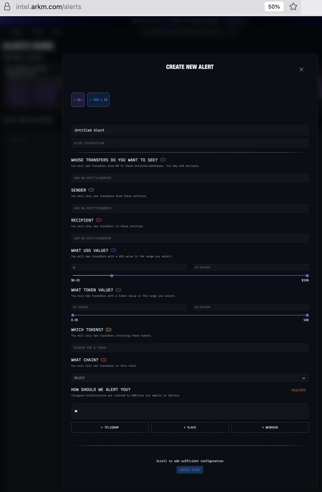

# Introduction to Transacting Privately with Cryptocurrency

The advent of digitally securable currencies, known as *cryptocurrency*, heralded a watershed moment for what was still a young Internet of the time. It happened in 2009 with the formal announcement of the first official release of software called *Bitcoin*. The notion of securing a financial system using the awesome power of modern cryptography has some obvious benefits, such as eliminating certain classes of fraud and abuse, but it comes with massive implications that variously both appeal to and threaten everyone who needs to participate in such a system. 

While Bitcoin remains one of the most important cryptocurrencies today, it was not initially designed for financial privacy. In many ways, the Bitcoin software was similar to other networked software applications of its day: it had a peer-to-peer (P2P) architecture where anyone who ran an instance of the program, called *Bitcoin Core*, would connect to other instances of the same software in order to transmit and receive data from them that, eventually, all users would share on a special kind of distributed database called a *blockchain*.

This sharing of data meant that every single user of the Bitcoin software who joined the network and downloaded its blockchain database would eventually have the exact same view of the data in the network. Since everyone on the network shared all the data of the network, everything anyone did on the network was visible to everyone else on the network at any time. And since valid transactions were always ever appended to, never deleted, anything anyone ever did on the network remained enshrined in the network's account of its own history for as long as at least one copy of the network's data survived.

For certain use cases requiring transparency, such as auditing non-profit or government revenues and expenses, such a system makes a lot of sense. But there are many situations in which publicizing financial dealings this way poses serious risks to life or liberty for all sorts of individuals and groups of people.

Enter *privacy coins*, a newer class of cryptocurrencies whose technology can obscure or even fully encrypt all parts of a cryptocurrency transaction without compromising the same digitally securable methods as originally offered by Bitcoin. Effective privacy coins such as *Zcash* and *Monero* have been incredibly popular among online communities where financial privacy is key to survival. And as centralized fiat payment processors like credit card companies or digital payment apps increasingly restrict the sorts of transactions they permit their own networks be used for, it becomes increasingly important to understand how such privacy coins offer financial independence and protection from corporate or State surveillance.

In this practice lab, you will learn enough about cryptocurrencies to make use of both transparent (non-private) and opaque (private) cryptocurrencies for buying, selling, or trading anything you can find a buyer, seller, or trading partner for. In the process, we'll gain exposure to some cryptocurrency analytics tools, called *block explorers*, to show you how you might be observed when transacting on the non-private, transparent ledger systems like Bitcoin, debunking privacy myths along the way. Although familiarity with some basic computer operation skills will be helpful (using a smartphone app, a Web browser, copy and paste, and so on), we try to present the material in a way that even someone who has never touched cryptocurrency before will be able to benefit.

# Contents

1. [Objectives](#objectives)
1. [Bill of materials](#bill-of-materials)
1. [Prerequisites](#prerequisites)
1. [Set up](#set-up)
1. [Practice](#practice)
    1. [Introduction](#introduction)
    1. [Your first cryptocurrency wallet](#your-first-cryptocurrency-wallet)
    1. [Onramping: acquiring crypto](#onramping-acquiring-crypto)
        1. [Know Your Know-Your-Customer (KYC)](#know-your-know-your-customer-kyc)
    1. [Understanding custodial schemes for cryptocurrency assets](#understanding-custodial-schemes-for-cryptocurrency-assets)
    1. [Addresses, wallets, accounts, oh my!](#addresses-wallets-accounts-oh-my)
    1. [Performing currency swaps](#performing-currency-swaps)
    1. [Understanding netflows and coinflows](#understanding-netflows-and-coinflows)
1. [Discussion](#discussion)
    1. [Evolution of blockchain data analytics](#evolution-of-blockchain-data-analytics)
    1. [Cryptocurrency and blockchain de-anonymization techniques](#cryptocurrency-and-blockchain-de-anonymization-techniques)
        1. [De-anonymization via KYC/AML data](#de-anonymization-via-kyc-aml-data)
        1. [De-anonymization via open sources intelligence (OSINT) and public data](#de-anonymization-via-open-sources-intelligence-osint-and-public-data)
        1. [De-anonymization via address clustering](#de-anonymization-via-address-clustering)
        1. [De-anonymization via transaction analysis](#de-anonymization-via-transaction-analysis)
        1. [De-anonymization via-dusting-attacks](#de-anonymization-via-dusting-attacks)
        1. [De-anonymization via Internet Protocol (IP) network analysis](#de-anonymization-via-internet-protocol-ip-network-analysis)
1. [Additional references](#additional-references)

# Objectives

When you complete this lab, you will have acquired the following capabilities:

* The ability to receive and send monetary funds in a private and discreet manner using a cryptocurrency "wallet" application.
* The ability to anonymously convert ("exchange" or "swap") otherwise incompatible cryptocurrencies for one another.
* The ability to purchase goods and services without the cryptocurrency transaction itself revealing unnecessary information about you.
* An understanding of how to assess "coinflow" analytics and observe other people's transactions on transparent blockchains.

# Bill of materials

This folder contains the following files and folders:

* `README.md` - This file.

# Prerequisites

To perform this lab, you must have:

* A smartphone running any modern version of:
    * Android,
    * Apple iOS (such as an iPhone or iPad).
* A computer running any modern version of:
    * Windows,
    * macOS, or
    * any flavor of the GNU/Linux operating system.
* An active Internet connection.

# Set up

In addition to your smartphone and laptop or desktop computer, you will need to acquire the following tools.

On your smartphone, you will need the following wallets:

* [Zashi](https://electriccoin.co/zashi/), for Zcash transactions
* [Cake Wallet](https://cakewallet.com/), for Monero and Bitcoin transactions, or
* [Edge Wallet](https://edge.app/), for Monero and Bitcoin transactions.

For educational purposes, the authors recommend acquiring all three.

On your laptop or desktop computer, for maximum privacy, you will also need:

* [Tor Browser](https://www.torproject.org/download/)

Follow the above links. Then download and install the appropriate software packages for your operating system. The installation processes should be familiar, since they are performed in the same way as for any other software application that runs on your operating system.

## Zashi installation on Android

> :construction: TODO

## Zashi installation on Apple iOS

> :construction: TODO

## Cake Wallet installation on Android

> :construction: TODO

## Cake Wallet installation on Apple iOS

> :construction: TODO

## Edge Wallet installation on Android

> :construction: TODO

## Edge Wallet installation on Apple iOS

> :construction: TODO

## Tor Browser installation on Windows

> :construction: TODO

## Tor Browser installation on macOS

> :construction: TODO

## Tor Browser installation on GNU/Linux

> :construction: TODO

## Tor Browser installation on Android

> :construction: TODO

# Practice

We'll begin by ensuring you have successfully completed the [set up](#set-up) steps. This process will also introduce the fundamentals that you need to understand to complete the rest of the exercise.

## Introduction

The Bitcoin project was famously spearheaded by a mysterious entity named Satoshi Nakamoto, who remains anonymous to this day; no one knows whether Satoshi Nakamoto is a single individual or a group of people. What is known is that the Bitcoin software combined several old ideas in a novel way and, in so doing, birthed the possibility for an economic revolution unlike anything the world had seen before: cryptographically secure money.

Rather than merely trust one another, each individual node in the network that ran a complete copy of the Bitcoin software was programmed to *cryptographically validate* every incoming message, called a *transaction* in Bitcoin's parlance, ensuring it met certain criteria. If the transaction's math literally didn't add up, it would be discarded and ignored.

Prior to Bitcoin, money was susceptible to certain kinds of manipulation in the physical world. When gold was considered the equivalent of money, discovering veins of gold in gold mines or panhandling in rivers meant literally finding more money in the world. Later, when the value of legally binding tender like the US Dollar was disassociated from the value of gold on April 20th, 1933, governments could simply create more money on demand by printing more of it and declaring it valid. But with Bitcoin, the supply of money in circulation, known as metaphorical "coins" or, sometimes and more generically, *tokens*, was mathematically fixed by an algorithm computed each and every time any transaction on the network was tested for validity.

Theoretically, this meant that anyone who ran the Bitcoin software could absolutely trust that a financial transaction would provide exactly and only the precise value they expected it to. But it also meant that such transactions would never validate if they included counterfeit coinage, promising to eliminate a whole category of financial fraud.

To use a cryptocurrency and access its network yourself, you need special software designed to interact with the specific cryptocurrency you want to use. Since we'll be concerning ourselves primarily with making transactions, rather than ensuring the validity and stability of the network, we'll use a certain subcategory of cryptocurrency software called *wallet apps* (or just "*wallets*" for short). Let's get you a wallet now.

### Your first cryptocurrency wallet

A *wallet*, *wallet app*, or *crypto wallet* is simply a software program or application that you use to manage your interactions with the cryptocurrency network for you. You can think of it a little bit like a Web browser, but for your cryptocurrency tokens instead of for Web sites and pages. Choosing a wallet app is also a bit like choosing a Web browser. Different people have their favorites, for their own reasons, and which one you ultimately choose to use depends on a combination of the features you need, the aesthetics you like, and the support community you have available to you.

Also like a Web browser, different wallet apps implement their features in ways that can be more or less accomodating of privacy concerns. Unfortunately it isn't enough to simply use a privacy coin cryptocurrency if you want to achieve the best level of privacy that you can. For that, you must also interact with that privacy coin's cryptocurrency network using a wallet app that won't leak data you don't need it to. Not all wallet apps fit that bill.

The authors of this guide have their preferences, but as each cryptocurrency ecosystem evolves, we encourage you to do additional research and choose a wallet app that suits you. In the meantime, you are also welcome to stick to [our recommendations](#set-up), which are described above.

When you first open most wallet apps, the app will probably prompt you to generate and save a set of randomly generated words (most commonly 12 or 14) called a *seed phrase*, *recovery phrase*, or *mnemonic code*. This phrase acts like a password, and denotes a secret that you should keep well protected, because it grants full access to spend any of the coins, tokens, or funds that you acquire. We strongly advise you to record your new wallet app's seed phrase somewhere safe, such as in a [password manager](../../mr-robots-netflix-n-hack/week-2/strengthening-passwords-to-defend-against-john/README.md#using-a-password-manager) that you trust.

> [!TIP]
> Seed phrases are portable across many different wallet apps. If you remember your wallet app's seed phrase, you can completely erase your wallet app along with all the data in it, and still easily recover (or "import") your prior token balance and other transaction data from the cryptocurrency network, even if you use a different wallet app in the future. Seed phrases are based on a standard algorithm themselves and work by encoding the bits of a primary cryptographic key that is later used in a hierarchically deterministic algorithm to generate the actual private keys for various cryptocurrency system addresses. Using this system, your single wallet app can contain many millions upon millions of individual cryptocurrency addresses, while requiring you to remember only one set of "seed" words to gain access to all of them.
>
> Among other benefits, this makes it easy to migrate your funds from one wallet app to another, as long as both of the wallet apps you choose support the same seed phrase algorithm.

**Do this** to ensure your cryptocurrency wallet app is installed and set up for first use:

> :construction: TK-TODO

Now that you have a wallet app installed, and you've stored your seed phrase somewhere safe, it's time to acquire some funds to fill your empty wallet app with.

### Onramping: acquiring crypto

Cryptocurrency is most intuitively understood as cash. (That's kind of the whole idea, anyway.) An empty wallet isn't very useful. You need something for it to store. In the case of a physical wallet, that something is physical notes or coins. In the case of a cryptocurrency wallet app, that something is its metaphorical equivalent, which are cryptocurrency tokens.

> [!TIP]
> In reality, cryptocurrency wallet apps don't store any tokens. Instead, they store *private keys*, the numerical secret from which public *blockchain addresses* are derived and that grant the power to spend the tokens assigned to those addresses. This is what makes it technically possible to delete your wallet app and still recover your transaction data from the seed phrase you stored earlier; you're not actually deleting your tokens, you're just deleting a copy of the pointers (addresses) to the relevant transactions.

Cryptocurrency transactions are trades; you give someone a metaphorical coin, and they give you something in exchange. The most intui

#### Know Your Know-Your-Customer (KYC)

### Understanding custodial schemes for cryptocurrency assets

### Addresses, wallets, accounts, oh my!

> :construction: TK-TODO: These are mostly notes, for now.

### Performing currency swaps

- An exchange keeps a liquidity pool in order to service swaps.
- Many exchanges exist, but most are strict about requiring KYC before they will let you access any part of their liquidity pool for swaps.
- Making swaps is a direct interaction with an exchange directly or with a service that proxies your request for making a swap, so your privacy is also affected by which you choose for the network interaction.
- Trocador.app is an aggregator that rates exchanges based on their privacy policy guarantees *and* also offers a programmatic API to their partner exchanges via their own anonymizing proxy. They have a JavaScript-free version at https://noscript.trocador.app that can be accessed freely and anonymously over Tor!

### Understanding netflows and coinflows

> :construction: TK-TODO: These are mostly notes, for now.

- Netflow is network-level data trails, where packets come from and go to, their IP addresses, and so on.
- Coinflow is cryptocurrency network data trails, where transactions are sent to and originate from, what their amount is, and so on.
- Use Tor (or Tor Browser) to protect against netflow analysis.
- Only opaque ledger sysetms offered by privacy coins such as Zcash or Monero can fully protect against coinflow analysis.
    - Some privacy-enhanced L2's like Lightning claim to protect against some coinflow analysis, but none protect as thoroughly as encrypted L1s like Zcash or Monero.

### 

# Discussion

## Evolution of blockchain data analytics

As new technologies and data formats become adopted, there is a period of time during which they are difficult to understand or manipulate simply because the tooling for using the new technology is itself rather new. This often leads people to believe that newer technology is "more secure" or "more private" than it really is simply because there is no easily usable way to visualize or analyze the new data format. Over time, though, this is often proved untrue, as better and more intuitive interfaces to that same data becomes more widely available, itself.

This is happening again with blockchain data. Transparent ledger systems like Bitcoin contain a wealth of historical information, but this data is stored in a technology-specific format and few publicly available consumer tools exist for analyzing and making sense of this data in a way that is clear to non-experts. However, such tools are getting better all the time and, as you might expect, corporations and governments are ahead of the game on this.

In the early years after Bitcoin's release, the only meaningful tools were called [blockchain explorers](https://support.bitcoin.com/en/articles/4363796-how-to-use-a-bitcoin-blockchain-explorer), which simply decoded the data stored in each block that was "mined" (i.e., cemented into the cryptographic history of the chain of blocks making up the blockchain itself). Blockchain explorers are still the most common form of blockchain data analytic tools that exist today because they are also the simplest to create and the least capable.

Popular blockchain explorers exist for different blockchain databases (or "chains"). Some of the better and more visual ones include:

* [BTCScan.org](https://btcscan.org/) - Straightforward blockchain explorer for the Bitcoin cryptocurrency network.
* [EtherScan.io](https://etherscan.io/) - Ethereum network blockchain explorer with clever support for [Ethereum Name Service (ENS)](https://ens.domains/) name-to-address mappings.
    * For example, [look up `vitalik.eth` on EtherScan.io's blockchain explorer](https://etherscan.io/name-lookup-search?id=vitalik.eth).
* [Cake Wallet's Monero Block Explorer](https://monero.com/explorer) - Web-based blockchain explorer that demonstrates Monero's additional privacy features by requiring transaction secret keys before displaying transaction details.
* [Zcash Blockchain Explorer](https://zcashexplorer.app/) ([Source code](https://github.com/nighthawk-apps/zcash-explorer)) - Similar blockchain explorer but for Zcash. Also shows popular transparent addresses with their identities, such as which transactions are made by large exchanges like Coinbase.
    * Also available as a [Tor v3 Onion service](http://zcashfgzdzxwiy7yq74uejvo2ykppu4pzgioplcvdnpmc6gcu5k6vwyd.onion/).

Over time, all the capabilities you might expect from automatable systems are being added to blockchain ecosystem toolkits. For example, [Arkham Intelligence provides a free service to send you alerts](https://intel.arkm.com/alerts) and notifications based on activity that it can see on any of its supported (transparent) ledgers, as shown here:

[Arkham Intelligence](https://arkm.com/) is noteworthy as an early entry into the cryptocurrency analysis space that started using artificial intelligence (AI) to identify and catalog the owners of blockchain addresses.

While the majority of the more sophisticated analytics tools are still not public, they exist, as evidenced by the proliferation of "cryptocurrency investigatory" services that claiming to "track down your stolen digital assets," as companies like [Bitquery advertises](https://bitquery.io/products/crypto-investigation-services). Famously, [Chainalysis works with government law enforcement officers](https://www.chainalysis.com/blog/chainalysis-fbi-caesars-ransomware-recovery/) and provides its [Reactor](https://www.chainalysis.com/product/reactor/) tool for these investigations. [Breadcrums](https://www.breadcrumbs.app/) is another leading contender in this space.

## Cryptocurrency and blockchain de-anonymization techniques

> :construction: TK-TODO:

### De-anonymization via KYC/AML data

"Utilizing Know Your Customer (KYC) and Anti-Money Laundering (AML) information from centralized exchanges to link user identities to specific addresses"

### De-anonymization via open sources intelligence (OSINT) and public data

"Employing rules and patterns derived from transaction data to infer relationships between addresses"

### De-anonymization via address clustering

"Analyzing patterns of transactions between addresses to group those likely belonging to the same user"

### De-anonymization via transaction analysis

"Examining the flow of funds, transaction amounts, and timing to identify connections between addresses and potentially link them to real-world entities"

### De-anonymization via "dusting" attacks

"Sending small amounts of cryptocurrency (so-called "dust") to multiple addresses to see which ones are combined in future transactions, revealing connections." Sort of combines address clustering and transaction analysis.

### De-anonymization via Internet Protocol (IP) network analysis

"Studying the connections within the blockchain network to identify patterns and potentially trace transactions back to specific users."

# Additional references

> :construction: TK-TODO

* [Crypto Pills #10: BIP32 Derivations in Depth](https://medium.com/@guibv.avatar/crypto-pills-10-bip32-derivations-in-depth-3005da02ae6a)
* [EY Blockchain Analyzer: Solution Overview](https://web.archive.org/web/20250217162037/https://www.ey.com/content/dam/ey-unified-site/ey-com/en-us/services/blockchain/documents/ey-solution-brief-explorer-visualizer.pdf)
* [De-anonymizing Bitcoin](https://web.archive.org/web/20250727090726/https://www.schneier.com/blog/archives/2022/04/de-anonymizing-bitcoin.html) - Excerpted from Andy Greenberg's book, *Tracers In The Dark: The Global Hunt for the Crime Lords of Cryptocurrency*, discusses various de-anonymization techniques such as address clustering.
* [Deanonymization and Linkability of Cryptocurrency Transactions Based on Network Analysis](https://ieeexplore.ieee.org/document/8806723) - Revealing academic study on using traditional IP network analysis techniques to deanonymize Bitcoin users despite following Bitcoin's privacy best practices such as using new ("virgin") addresses for each new transaction to avoid transaction graph analysis.
