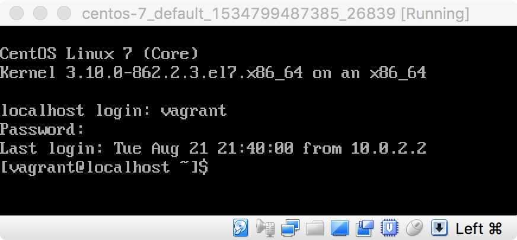

# Introduction to Virtual Machine Management with Vagrant

Virtualization and containerization are concepts almost as old as computing itself so, no matter what you&rsquo;re doing on your computer, you&rsquo;re probably using one form of it or another. For example, partitioning a hard disk chunks its total capacity into smaller units useful for specific purposes, much like the individual drawers in a dresser might separate undergarments from outerwear. Organizing, or &ldquo;containerizing,&rdquo; your closet this way is useful in its own right because it helps you keep things neat and orderly. But this organizing method also offers dramatic security enhancements because a misbehaving program (or dirty sock) will be confined to its own container.

Today, virtualization has become integral to how desktop computers, servers, and global data networks work, and cross-platform, Free Software virtualization programs have never been easier to use. Storage virtualization makes it possible for a single file on your computer to appear to be an entire hard disk drive (such as provided by [VeraCrypt](https://www.veracrypt.fr/)), network virtualization makes it possible to simulate different networks (e.g., using [VLANs](https://en.wikipedia.org/wiki/Virtual_LAN)) or even the whole Internet (using [INetSim](https://www.inetsim.org/)), processor virtualization makes it possible to run programs built for one microchip architecture on computers running a completely different one (e.g., in [QEMU](https://www.qemu.org/)), and fully-fledged virtual machine monitors (VMMs) or hypervisors can construct and modify entire hardware environments complete with virtual video monitors and other peripherals on the fly (as is offered by [Proxmox](https://www.proxmox.com/)). Virtualization is even the bedrock of numerous Operating System and Web browser security features, such as in the [Qubes Operating System](https://www.qubes-os.org/), [macOS&rsquo;s App Sandbox](https://developer.apple.com/library/archive/documentation/Security/Conceptual/AppSandboxDesignGuide/AboutAppSandbox/AboutAppSandbox.html), and [Firefox Containers](https://support.mozilla.org/kb/containers).

In this starter lab, you will get up and running with virtual machines using the [VirtualBox](https://virtualbox.org/) type-2 hypervisor and the [Vagrant](https://vagrantup.com/) hypervisor automation utility. Together, these two tools make it possible to create and share configurations for a single machine, or a whole network of computers. Each of the practice labs in this repository use these tools to make it possible for us to create environments that will behave identically no matter what underlying software or hardware you are using, so becoming familiar with the basic operation of these tools is required before you can complete the other labs we provide.

# Contents

1. [Objectives](#objectives)
1. [Bill of materials](#bill-of-materials)
1. [Prerequisites](#prerequisites)
1. [Set up](#set-up)
    1. [VirtualBox installation](#virtualbox-installation)
    1. [Vagrant installation](#vagrant-installation)
1. [Practice](#practice)
    1. [Vagrantfile creation](#vagrantfile-creation)
    1. [Virtual machine startup](#virtual-machine-startup)
    1. [Virtual machine operation](#virtual-machine-operation)
        1. [Using the VirtualBox console](#using-the-virtualbox-console)
        1. [Connecting over SSH with Vagrant](#connecting-over-ssh-with-vagrant)
    1. [Turning off the virtual machine](#turning-off-the-virtual-machine)
    1. [Destroying the virtual machine](#removing-the-virtual-machine)
1. [Discussion](#discussion)
    1. [Vagrant multi-machine](#vagrant-multi-machine)
    1. [VirtualBox networking modes](#virtualbox-networking-modes)
1. [Additional references](#additional-references)

# Objectives

When you complete this lab, you will have acquired the following capabilities:

* The ability to use Vagrant to create VirtualBox-backed virtual machines.
* The ability to perform basic configuration and troubleshooting of VirtualBox-backed virtual networks.

# Bill of materials

This folder contains the following files and folders:

* `README.md` - This file.
* `Screenshots/` - Contains images used to augment the lab's textual material; these are not directly related to the lab's practice steps.

# Prerequisites

To perform this lab, you must have:

* A computer running any modern version of:
    * Windows,
    * macOS,
    * FreeBSD,
    * Solaris, or
    * any flavor of the GNU/Linux operating system.
* An active Internet connection (for downloading the required tools in the [set up](#set-up) step, as well as Vagrant base boxes, and the required software packages into the virtual machines; you do not need an Internet connection once you have completed the set up portion of this lab).

> :beginner: :computer: This exercise requires the use of a command line, or "terminal." If you don't know what that means, or if you do but you feel intimidated by that, consider going through [Tech Learning Collective&rsquo;s free, online and self-paced *Foundations: Command Line Basics* course](https://techlearningcollective.com/foundations/), spending an hour at [Apple's Terminal User Guide](https://support.apple.com/guide/terminal/) (for macOS users), [Ubuntu's Command Line for Beginners tutorial](https://ubuntu.com/tutorials/command-line-for-beginners) (for GNU/Linux users) or reviewing [Computer Hope's article, "How to use the Windows command line (DOS)"](http://www.computerhope.com/issues/chusedos.htm) (for Windows users) if you want to get started quickly. You don't need to complete the whole tutorial or article to understand this exercise, but it will dramatically improve your comprehension of this exercise's mechanics. If you want a more thorough but equally gentle introduction to the same material, consider reading (and listening to) [Taming the Terminal](https://www.bartbusschots.ie/s/blog/taming-the-terminal/).

# Set up

In addition to your laptop or desktop computer, you will need to acquire the following tools.

* For managing the virtual machines: [VirtualBox](https://www.virtualbox.org/) version 6.1 or newer, sometimes written as *VBox*.
* For automatically configuring virtual machine settings: [Vagrant](https://vagrantup.com/) version 2.2.7 or newer.

There are pre-built versions of the VirtualBox hypervisor software for Windows, macOS, GNU/Linux, and Solaris available for download from the [VirtualBox downloads page](https://www.virtualbox.org/wiki/Downloads). Your operating system's package repositories may also include a copy of VirtualBox, but be certain to double-check the version available there before installing it to ensure you are using a new-enough version of the software. For [FreeBSD users, VirtualBox is provided as a package or a source port and can be installed by following the instructions in the FreeBSD Handbook, §21.6](https://www.freebsd.org/doc/handbook/virtualization-host-virtualbox.html).

Similarly, there are pre-built versions of Vagrant for Windows, macOS, and numerous different GNU/Linux flavors available from the [Vagrant downloads page](https://www.vagrantup.com/downloads.html). [Vagrant is also provided as a FreeBSD port](https://svnweb.freebsd.org/ports/head/sysutils/vagrant/). Solaris users can [install Vagrant by installing from source](https://www.vagrantup.com/docs/installation/source.html).

## VirtualBox installation

In most cases, VirtualBox can be easily installed by [downloading the appropriate pre-built package](https://www.virtualbox.org/wiki/Downloads) for your operating system and hardware architecture and following the standard installation procedure as you would any other software. The [VirtualBox User Manual §1.5, "Installing Oracle VM VirtualBox and Extension Packs"](https://www.virtualbox.org/manual/UserManual.html#intro-installing) covers general installation procedures, while [Chapter 2: "Installation Details"](https://www.virtualbox.org/manual/UserManual.html#installation) offers specific guidance for each supported Operating System.

## Vagrant installation

In most cases, Vagrant can be easily installed by [downloading the appropriate pre-built package](https://vagrantup.com/downloads.html) for your operating system and hardware architecture and following the standard installation procedure as you would any other software. [Vagrant's Installation docs](https://www.vagrantup.com/docs/installation/) offers installation guidance for each supported Operating System.

# Practice

Now that you have the required virtualization and automation software tools installed, let's have a look at how to use these tools.

If you haven't already, consider skimming through the [VirtualBox User Manual](https://www.virtualbox.org/manual/UserManual.html). This document describes the basic operation of VirtualBox and provides a thorough reference for all of its various functions and capabilities. We won't repeat here what is already published there, but we will often refer to specific sections of the VirtualBox User Manual. We suggest you keep the manual at the ready even if you don't want to read it all now.

Similarly, if you haven't already, consider skimming through the excellent [Vagrant documentation](https://www.vagrantup.com/docs/). As with VirtualBox, we won't repeat here what is already published there, but we will often link to specific parts of the Vagrant documentation for you to refer to. We suggest you bookmark the Vagrant documentation homepage so that you can quickly access it even if you don't want to read it all now.

## Vagrantfile creation

Once VirtualBox is installed and running, you can manually create a new virtual machine by using the VirtualBox Manager graphical user interface (GUI) application, described in [the VirtualBox Manual §1.7](https://www.virtualbox.org/manual/ch01.html#idm272). Setting up a new virtual machine through the graphical interface typically requires many clicks, and can take a considerable amount of time. Vagrant is used to automate this process so that a virtual machine with a given configuration is accessible to you in mere moments.

To accomplish this, Vagrant reads files that describe various aspects of a virtual machine. These aspects range from what hardware to virtualize (e.g., how many network adapters the virtual machine should have, or how much memory should be installed into it), to what commands should be run when the virtual machine boots up for the first time (e.g., which software packages to install to prepare it for a given use). All of this information is contained within [a file literally named `Vagrantfile`](https://www.vagrantup.com/docs/vagrantfile/).

A single `Vagrantfile` is intended to describe a complete Vagrant *project*. When Vagrant finds a `Vagrantfile`, the folder in which the `Vagrantfile` is found is considered the Vagrant *project root*.

> :bulb: A single `Vagrantfile` can actually describe the configuration of multiple virtual machines. See the [Vagrant multi-machine](#vagrant-multi-machine) discussion for more information on this Vagrant feature.

Since a Vagrant project must contain a `Vagrantfile`, we will need to make a folder to house that file, or choose an existing folder to designate as the root of our Vagrant project. Inside that folder, we must write a `Vagrantfile` that describes the configuration of the virtual machine we want to have created. We can repeat this process to describe our desire for a second machine, or we can edit the `Vagrantfile` to include a second machine definition.

Vagrant's main command line utility (`vagrant`) offers a number of convenience functions to help us write these `Vagrantfile`s. We'll use [the `vagrant init` command](https://www.vagrantup.com/docs/cli/init.html) for this purpose. Let's create our Vagrant virtual machine configurations now.

**Do this:**

1. Create a new folder named `centos-7`:
    ```sh
    mkdir centos-7
    ```
1. In the `centos-7` folder, create a new file named `Vagrantfile` that contains a Vagrant configuration for a CentOS 7 virtual machine:
    ```sh
    vagrant init --minimal --output centos-7/Vagrantfile centos/7
    ```

The final argument to the `vagrant init` command (`centos/7`) map to Web addresses of pre-packaged virtual machine settings and hard disk images containing pre-installed copies of the named operating system at the specified version. These pre-packaged virtual machine environments are called [*Vagrant boxes*](https://www.vagrantup.com/docs/boxes.html). A public catalog of Vagrant boxes is available at [VagrantCloud.com](https://vagrantcloud.com/), and [the `centos/7` Vagrant box](https://app.vagrantup.com/centos/boxes/7) is listed there.

In this command, the `--minimal` flag is optional. It merely instructs the `vagrant init` command not to include instructional comments in the written `Vagrantfile`. These comments are useful for new projects but unnecesary for this lab.

The `--output` flag is how you can tell `vagrant init` to write the `Vagrantfile` at a particular filesystem location, rather than the default. The default is simply to place the written `Vagrantfile` in the current folder. Since we wanted to write the `Vagrantfile` into the folder we just created, we specified `--output` explicitly.

At this point it would behoove you to inspect the `Vagrantfile`, so open it in a text editor. Find the line that begins with `config.vm.box`. This is a variable assignment. When Vagrant loads a `Vagrantfile`, it constructs a `config` object. The `config` object has a `vm` member variable, which is also an object. [In this `vm` object, Vagrant keeps the specific settings for the virtual machine](https://www.vagrantup.com/docs/vagrantfile/machine_settings.html). In this case, the `box` variable stores the name of the Vagrant box on which this Vagrant project is based.

> :beginner: This multi-level ("nested") object construction is typical of code written in the [Ruby](https://ruby-lang.org/) programming language. In fact, a `Vagrantfile` is just a Ruby script with numerous pre-defined variables that you are expected to set as you desire. Since a Vagrantfile is just a Ruby script, the more Ruby you learn, the more your Vagrantfiles can do. If Ruby is new (and interesting) to you, we encourage you to spend some time at [Codecademy's Learn Ruby tutorial](https://www.codecademy.com/learn/learn-ruby). If you have less time, you can also [visit TryRuby to get an interactive, whirlwind tour in your Web browser](https://ruby.github.io/TryRuby/). We also like [Ruby Monsters's Ruby for Beginners guide](https://ruby-for-beginners.rubymonstas.org/).

For instance, the CentOS 7 machine's `Vagrantfile` should have a line that looks like this:

```ruby
config.vm.box = "centos/7"
```

If you had instead asked for a different base box, perhaps `ubuntu/xenial64`, the `Vagrantfile` should have a similar line, but the `config.vm.box` variable should be assigned a different value:

```ruby
config.vm.box = "ubuntu/xenial64"
```

Regardless of the base box you selected, on the left side of the equals sign (`=`) is the fully-qualified name of the variable (`config.vm.box`). The equals sign is Ruby's assignment operator, which takes the value to the right of the equals sign and saves it to the variable named on the left. After Vagrant reads this line in your `Vagrantfile`, Vagrant will know which box you want to use in your project.

Every virtual machine that Vagrant configures always has at least one network adapter. [For VirtualBox, this first network adapter and its configuration is hard-coded and cannot be changed](https://www.vagrantup.com/docs/virtualbox/boxes.html#virtual-machine). (Well, not without changing the source code for Vagrant itself, anyway). Vagrant always configures this adapter to use [VirtualBox's `NAT` networking mode](https://www.virtualbox.org/manual/ch06.html#network_nat). In this mode, the virtual machine is able to access the Internet through the physical (host) machine's own network connection, but no other machines can access it because it is placed behind a virtual [Network Address Translation (NAT)](https://simple.wikipedia.org/wiki/Network_address_translation) router of its own.

> :beginner: In addition to virtualizing "machine" hardware, VirtualBox (and most other hypervisors) can also virtualize *network* devices, including routers, switches, and even some network services, in order to create a network environment in which the virtual machine can operate. A full discussion of network engineering is beyond the scope of this lab, but see the [VirtualBox networking modes](#virtualbox-networking-modes) discussion section, below, for additional information. For now, suffice it to say that without correctly configuring a second network adapter to your VirtualBox-backed and Vagrant-configured virtual machine, no other virtual machine will be able to communicate directly with it.

Sometimes, you need more than one virtual machine. This is especially true if you are performing a networking exercise, in which your goal is to get two or more machines to interact over a network. In this case, your virtual machines must often each be attached to the same *virtual network*.

To accomplish this, we can instruct Vagrant to instruct VirtualBox to add a second virtualized [network interface card (NIC)](https://en.wikipedia.org/wiki/Network_interface_controller) to each machine and to connect both machines's second NIC to the same virtualized network. To have Vagrant add subsequent NICs to a virtual machine, we use [the `config.vm.network` method](https://www.vagrantup.com/docs/networking/basic_usage.html) call.

> :beginner: A *method*, in programmer-speak, is a function that an object can perform. In Ruby, everything is an object, so all functions are technically methods. In our case, the `config.vm` object is, as stated, an object, and `network` is the name of one of the `vm` object's functions. This is the method Vagrant uses to configure virtualized NIC hardware on the virtual machine. What a method or function actually does depends on the *arguments* given (or "passed") to it.

Each time we call the `config.vm.network` method, Vagrant tries adding another NIC to the virtual machine it's building for us. We'll often want to ensure that our second NIC is not accessible by the outside world, so we'll pass [`"private_network"`](https://www.vagrantup.com/docs/networking/private_network.html) as the first [(positional) argument](https://ruby-doc.org/core-2.0.0/doc/syntax/calling_methods_rdoc.html#label-Positional+Arguments) to the method. Further, we usually want to have Vagrant configure the virtual machine's operating system to automatically configure an IP address for that network interface, so we'll also pass `type: "dhcp"` as a [keyword argument](https://ruby-doc.org/core-2.0.0/doc/syntax/calling_methods_rdoc.html#label-Keyword+Arguments). Finally, we don't just want to attach the network interface card to any random network, but a specific network, so we'll give this network a name, say `testnet`, by passing `virtualbox__intnet: "testnet"` as another keyword argument. The full method call will look like this:

```ruby
config.vm.network "private_network", type: "dhcp", virtualbox__intnet: "testnet"
```

> :beginner: While the `testnet` (part of the `virtualbox__intnet` keyword argument) is arbitrary—it merely needs to be the same for both machines—the `type: "dhcp"` keyword argument is not. It refers to the [Dynamic Host Configuration Protocol](https://simple.wikipedia.org/wiki/Dynamic_Host_Configuration_Protocol). DHCP is a way that network administrators can automatically inform machines joining their network what networking parameters they should use in order to have access to network services, not least of which is access to the Internet. You may not have heard about it before, but you probably use DHCP every time you connect to a Wi-Fi network. To learn more about what DHCP is and how it works, complete the [Introduction to Basic Network Administration](../introduction-to-basic-network-administration/README.md) practice lab.

Each of machine that you want to attach to the same virtual network must have this same line, and by including this same line in all machine configurations, they will all be attached to the same virtual network.

**Do this**:

1. Open the `Vagrantfile` for your CentOS 7 Vagrant project in a text editor.
1. Add the `config.vm.network` method call as described above inside the configuration block (i.e., immediately following the `config.vm.box` line), then save the file.

## Virtual machine startup

With your `Vagrantfile`(s) written, you're ready to start up the virtual machine(s) they describe. A number of additional things happen the very first time you turn on the virtual machines in a Vagrant project. This may include downloading their Vagrant boxes from the Internet as well as performing Vagrant's own initial setup of the virtual machine's operating system and user accounts. This often means that the first time you boot a virtual machine with Vagrant it can take a bit more time to complete than it will on subsequent startups.

To power on a virtual machine described in a `Vagrantfile` for the first time, you must first be somewhere within the Vagrant project. Then, you invoke [the `vagrant up` command](https://www.vagrantup.com/docs/cli/up.html). This instructs Vagrant to look for a `Vagrantfile` in the current directory, or continue [searching up the filesystem hierarchy in subsequent directories](https://www.vagrantup.com/docs/vagrantfile/#lookup-path) if a `Vagrantfile` is not in the current directory.

**Do this**:

1. In your terminal, change to the directory of your CentOS 7 virtual machine:
    ```sh
    cd centos-7
    ```
1. Power on the virtual machine:
    ```sh
    vagrant up
    ```
1. Wait until the first virtual machine has finished booting. Vagrant will display quite a bit of output during this process. If this is your first time booting a Vagrant virtual machine, take a minute to read some (or all!) of this output.

If successful, you should now have your CentOS 7 virtual machine running on the VirtualBox hypervisor. You can check that this is so by invoking [the `vagrant status` command](https://www.vagrantup.com/docs/cli/status.html) from within one of the Vagrant project directories. Alternatively, you can invoke [the `vagrant global-status` command](https://www.vagrantup.com/docs/cli/global-status.html) to see the current status of all your Vagrant projects in one list, regardless of your current working directory.

> :beginner: As you might expect, Vagrant can also shut down virtual machines, not just start them up. The command for this is [`vagrant halt`](https://www.vagrantup.com/docs/cli/halt.html). Additionally, Vagrant can also interface with numerous VirtualBox features such as [snapshots](https://www.virtualbox.org/manual/ch01.html#snapshots) (via [the `vagrant snapshot` command](https://www.vagrantup.com/docs/cli/snapshot.html)) and [saving or restoring the running state of the virtual machine](https://www.virtualbox.org/manual/ch01.html#idm485) (via [the `vagrant suspend`](https://www.vagrantup.com/docs/cli/suspend.html) and [`vagrant resume`](https://www.vagrantup.com/docs/cli/resume.html) commands, respectively). We strongly encourage you to peruse the excellent [Vagrant CLI documentation](https://www.vagrantup.com/docs/cli/) to learn more about what you can do using Vagrant's command-line interface.
>
> Importantly, when you're well and truly done with your Vagrant project or this practice lab, you'll want to use [the `vagrant destroy` command](https://www.vagrantup.com/docs/cli/destroy.html). This will delete the virtual machines defined in your `Vagrantfile` in their entirety, reclaiming your physical (host) machine's hard disk space and generally cleaning up after yourself.

Another way to check that your virtual machine is, in fact, powered on is simply to open the graphical VirtualBox Manager application. You should see that the virtual machine is now registered with VirtualBox and is shown to be in the "Running" state. Once the practice lab's virtual machine is up and running, you can continue to the next section.

## Virtual machine operation

> :beginner: A quick note on terminology: when discussing the relationship between a physical machine and a virtual machine, we say that the physical machine is the *host* machine and the virtualized machine is its *guest*. This is because the virtual machine (guest) is, ultimately, sharing resources with the underlying physical machine; it is at the mercy of its host. In this lab, we take care to make this distinction as clear as possible, though you will often hear the terms *host* and *guest* without much additional context.

In order to complete this lab, we must first be able to operate within the context of the virtual machine itself. Put another way, we need to leave our physical machine and enter the virtual machine. We can do this in one of two ways.

* Use VirtualBox to bring up a simulated video display and keyboard plugged directly into the VM's virtualized hardware.
* Use the SSH facility provided by Vagrant to access a command shell running in the VM's operating system.

It's useful to know about both of these methods because it's very possible that you will nullify your ability to use the second method (Vagrant's SSH facility) if you make certain errors during some practice labs. In case you do, you'll still be able to use the first method (the direct VirtualBox console) to recover. Your third option, of course, is to start over (discarding all your progress) by using [the `vagrant destroy` command](https://www.vagrantup.com/docs/cli/destroy.html).

### Using the VirtualBox console

Let's showcase the VirtualBox console first, and then try out Vagrant's (arguably more comfortable) SSH facility.

**Do this:**

1. Launch the graphical VirtualBox Manager application if it is not already opened as described in [§1.7, "Starting VirtualBox" of the VirtualBox Manual](https://www.virtualbox.org/manual/ch01.html#idm272).
1. Look for a virtual machine in the list on the left-hand sidebar of the main "Oracle VM VirtualBox Manager" window with a name that begins with `centos-7_default` and ends in numbers. This is the virtual machine Vagrant created for you.
    > :beginner: The numbers in your Vagrant virtual machine names are timestamps that indicate when the virtual machine was created. You can customize the name that vagrant gives to a VirtualBox virtual machine by adding [a special, VirtualBox-specific variable in your `Vagrantfile`](https://www.vagrantup.com/docs/virtualbox/configuration.html#virtual-machine-name). Without this special variable, Vagrant defaults to using the name of the folder containing the `Vagrantfile` with `_default_` and a timestamp appended to it as the name of the VirtualBox VM.
1. Double-click on the Vagrant virtual machine in the list. This will open a new window whose contents is the video output of the virtual machine's display.
1. Click once inside the window (which may be blank, or all black) to let VirtualBox *capture* your keyboard and mouse movements. VirtualBox will now route all your keyboard presses and mouse movements to the input of the virtual machine and away from your physical computer.
1. Press the `Enter` or `Return` key on your keyboard. Eventually, your virtual machine will notice the input and display a login prompt, as shown below:  
    
1. At the login prompt, type `vagrant` as the username, then press `Return`.
1. At the password prompt, type `vagrant` as the password, then press `Return`. Unlike the username prompt, the password you type will not be echoed back to your screen.

You should now be logged in to a command shell inside the virtual machine, as shown below:



This method of accessing your virtual machine emulates having a physical keyboard, video monitor, and possibly also a mouse directly attached to the virtual machine. The window that VirtualBox presents to you is the output of the virtual machine's video card. Your keyboard and mouse or trackpad is routing its input directly to the virtual machine. It's as though you have physically sat down in front of the machine itself.

Using the VirtualBox Manager in this manner means no network connections are involved. In fact, your virtual machine doesn't even need to have a network adapter installed for this to function. If you are ever unable to access your virtual machine using a network connection (like SSH), you can still control it through this emulated physical connection. You might hear this method described as a *direct console*, *serial console*, or *physical console*.

> :beginner: In order to disconnect your physical keyboard and mouse from the virtual machine and return to using your host computer normally, VirtualBox watches for any press of a special key it calls the *host key*. On most computers, this is the right Control key. On macOS computers, it is the left Command key. Learn more about [capturing and releasing keyboard and mouse input in §1.9.2 of the VirtualBox Manual](https://www.virtualbox.org/manual/ch01.html#keyb_mouse_normal).

### Connecting over SSH with Vagrant

Now that you can reliably control your virtual machine regardless of network connectivity, let's try using Vagrant's SSH facility to do the same thing.

**Do this:**

1. Release your keyboard and mouse from the virtual machine by pressing the VirtualBox host key. On most host machines, this is the right Control key. On macOS hosts, it is the left Command key.
1. From the *Machine* menu, choose *Detach GUI*. This will close the window showing the virtual machine's monitor without shutting down the virtual machine itself.
1. Return to your host terminal.
1. Navigate to the `centos-7` folder.
1. Use Vagrant to make an SSH connection and remotely log in to the CentOS 7 virtual machine using [the `vagrant ssh` command](https://www.vagrantup.com/docs/cli/ssh.html). If successful, you should see output similar to the following snippet:
    ```sh
    you@your-host$ vagrant ssh
    Last login: Tue Aug 21 22:26:15 2018
    [vagrant@localhost ~]$
    ```
    > :bulb: When you are using a Vagrant multi-machine configuration, you must specify the name of the machine to which you want to connect via SSH as a second argument. For example, if you have two machines named `machine1` and `machine2`, your command would be `vagrant ssh machine1` or `vagrant ssh machine2`.
1. Confirm that you are now remotely logged in to the virtual machine and have assumed the `vagrant` user identity by issuing a command such as `whoami(1)` or `who(1)`. For example:
    ```sh
    [vagrant@localhost ~]$ whoami
    vagrant
    [vagrant@localhost ~]$ who
    vagrant  tty1         2018-08-21 22:26
    vagrant  pts/0        2018-08-21 22:56 (10.0.2.2)
    [vagrant@localhost ~]$
    ```

You are now at the command line of the CentOS 7 virtual machine. Using `vagrant ssh` from a Vagrant project directory, you can immediately access the command line of the virtual machine using the pre-provisioned SSH server that came as part of the Vagrant box and the first (NAT'ed) network adapter that Vagrant instructs VirtualBox to attach to the virtual machine.

To return to your host computer's command line, use the `exit` command when you are logged in to the guest.

## Turning off the virtual machine

Virtual machines may be easy to manage, but they still take up quite a bit of physical resources, suh as memory on your host machine that all the other programs you are using might need. In this sense, virtual machines are very much like physical machines: you should probably turn them off when you're not using them.

Turning off a virtual machine managed by Vagrant is extremely simple. By invoking [the `vagrant halt` command](https://www.vagrantup.com/docs/cli/halt.html) command, the virtual machine(s) in your Vagrant project will be shut down.

## Destroying the virtual machine

Even if your virtual machine is powered down, it may still be taking up resources on your physical host computer that you want to use for other purposes, such as hard disk space. That's why, when you are well and truly done with a virtualized environment, you should completely remove it from your system to reclaim all the resources previously reserved by the virtual machine(s) that were part of your Vagrant project.

To do this, invoke [the `vagrant destroy` command](https://www.vagrantup.com/docs/cli/destroy.html). After confirming that, yes, you really do want to delete everything in your virtualized environments, Vagrant will delete the virtual machine's hard disk drive image files along with all references to the machine in your hypervisor, including any snapshots or other saved state information. This wipes the slate clean and returns your computer to the state it was in before you first ran `vagrant up` to bring the virtual machine(s) online.

# Discussion

## Vagrant multi-machine

[Vagrant's multi-machine features](https://www.vagrantup.com/docs/multi-machine/) make it easy to have a single `Vagrantfile` that defines more than one virtual machine. This means you can bring up two or more distinct virtual machines with a single invocation of the `vagrant up` command to, for example, simulate more complex lab environments that require two or more computers, perhaps communicating over a network. Many of our labs make use of this feature to demonstrate networking-related concepts and practices while keeping operational instructions short.

To define a multi-machine configuration, you wrap your `config.vm` object definitions in an outer `config.vm.define` Ruby block, like this:

```ruby
# The outermost `Vagrant.configure("2")` block begins the Vagrant configuration.
Vagrant.configure("2") do |config|

  # A call to the `config.vm.define` method provides a name for the
  # new machine to Vagrant, here called `name-of-machine-for-vagrant`.
  config.vm.define "name-of-machine-for-vagrant" do |c|

    # Here, at the innermost block is where you define the VM itself,
    # just as you do for a single Vagrant machine configuration.
    c.vm.box = "centos/7"

  end

  # Optionally, you can repeat the `config.vm.define` method call as
  # many times as you want to create more VMs with Vagrant.
  config.vm.define "name-of-another-machine" do |c|
    config.vm.box = "ubuntu/xenial64"
  end

end
```

Note that at the inner-most block, the `config` object is referenced by the shorter `c` variable, as per normal Ruby scoping and variable assignment rules.

## VirtualBox networking modes

Much like any other good hypervisor, in addition to virtualizing "machine" hardware such as a computer's processor, peripheral devices like a keyboard, video monitor, and graphical pointing device ("mouse"), and disk drives, VirtualBox can also virtualize *network* devices, including routers, switches, and even some network services (i.e., [DHCP](https://simple.wikipedia.org/wiki/Dynamic_Host_Configuration_Protocol) servers). VM hypervisors need this capability if they are to create a network environment in which the virtual machine can operate. Without this ability, your virtual machine would never be able to make a network connection, and wouldn't be able to do things like browse the Web or run servers for other machines to use.

Virtual networks, just like physical networks, can be constructed in a number of different ways, or configurations. These configurations are referred to as *network topologies*, because they define the way in which the various network devices and the machines on that network are interconnected. For example, one device, let's call it Device A, may be connected to only one other device, let's call it Device B. In turn, Device B might also be connected to only one other device, perhaps called Device C. A network diagram of this topology might look like this:

```
┌----------┐      ┌----------┐      ┌----------┐
| Device A | <--> | Device B | <--> | Device C |
└----------┘      └----------┘      └----------┘
```

Network topologies therefore describe the shape of a given network and the *path* a given message (called a "packet" in network engineering lingo) must take to get from one device to another. This topology, in which all devices are connected in a straight line, is called a [*bus network*](https://simple.wikipedia.org/wiki/Bus_network), and it is one of the simplest possible networks you can create. You could think of network engineering a bit like a "connect the dots" game, where the devices are the dots (sometimes also called "nodes" or "hosts") and the physical (or, in our case, virtual) network cabling are the lines connecting them.

VirtualBox provides several facilities for designing a network topology in whatever shape you like. Of these, VirtualBox's *networking modes* is the feature you'll use to connect a virtual machine to the network. Each of a virtual machine's network adapters can be configured in one (and only one) of these networking modes at a time. You can use either the [VirtualBox Manager graphical application](https://www.virtualbox.org/manual/ch01.html#idm272) or [the `VBoxManage(1)` command line utility](https://www.virtualbox.org/manual/ch08.html), installed along with the main VirtualBox hypervisor itself, to set any of a given virtual machine's available network adapters to the desired VirtualBox networking mode, as shown in the screenshot below:


For the purposes of this lab, the important networking modes you should be aware of are:

* `Not attached` - This networking mode means exactly what it says on the tin: the (virtual) network interface card is not attached to the (virtual) computer!
* `NAT` - This is the networking mode required by Vagrant. The first network adapter of a VirtualBox-backed virtual machine must be set to this mode for Vagrant to be able to work with the virtual machine. This networking mode virtualizes both a network cable and also a [Network Address Translation (NAT)](https://simple.wikipedia.org/wiki/Network_address_translation) router to which the virtual machine is connected.
    > :beginner: A NAT router is a network device that isolates machines connected to one specific side of it (the "outside") from machines on the other (the "inside"). For example, a machine connected to the "outside" of the NAT router can receive messages from and send messages to the NAT router itself, but cannot send any unsolicited messages to the machines on the "inside" of the router. Put another way, the machines on the "inside" are hidden from the machines on the "outside." However, machines connected to the "inside" of the NAT router (like the virtual machine whose network adapter is configured in this VirtualBox networking mode) *can* send messages to machines on the "outside" *and* the machines on the outside can send *responses* back to the machines on the inside.
    >
    > In this way, a NAT router functions a little bit like a doorperson at the front door of an apartment complex, bouncing any unsolicited visitors away and preventing them from entering but allowing residents to exit and invite any desired visitors inside. This mechanism of hiding the inside machines from those on the outside is called *network masquerading*. It's also why two virtual machines configured to use VirtualBox's NAT networking mode cannot speak to each other, but can each access the Internet. That is, they are isolated apart from one another (because they live in different metaphorical apartment complexes) but not from the outside world so long as they, themselves, are the ones who initiated the connection to the outside world.
    >
    > In networking lingo, the "inside" of a NAT router is called the *local* or *private* side, and the "outside" of a NAT router is called the *wide* or *public* side. This is one of the situations where the terms *[local area network (LAN)](https://simple.wikipedia.org/wiki/Local_area_network)* and *[wide area network (WAN)](https://en.wikipedia.org/wiki/Wide_area_network)* are frequently used.
* `Internal Network` - This networking mode creates an entirely new network that is wholly separate from both the outside world and any other virtual network. VirtualBox's internal networks can be *named* so that more than one virtual machine can be connected to the same internal network. This is handy for creating networks that are completely disconnected from any other network (including disconnected from the Internet!) but that can nevertheless house more than one virtual machine at a time.

More complete information about VirtualBox's various networking modes, including additional networking modes not mentioned in this section, are detailed in [§6.2, "Introduction to networking modes," of the VirtualBox Manual](https://www.virtualbox.org/manual/ch06.html#networkingmodes).

# Additional references

* [Building Virtual Machine Labs: A Hands-On Guide](https://leanpub.com/avatar) - Free e-book written by [Tony Robinson](https://twitter.com/da_667) with many exercises similar to this one that show how to go about building and maintaining your own home or workplace virtual lab environment.
